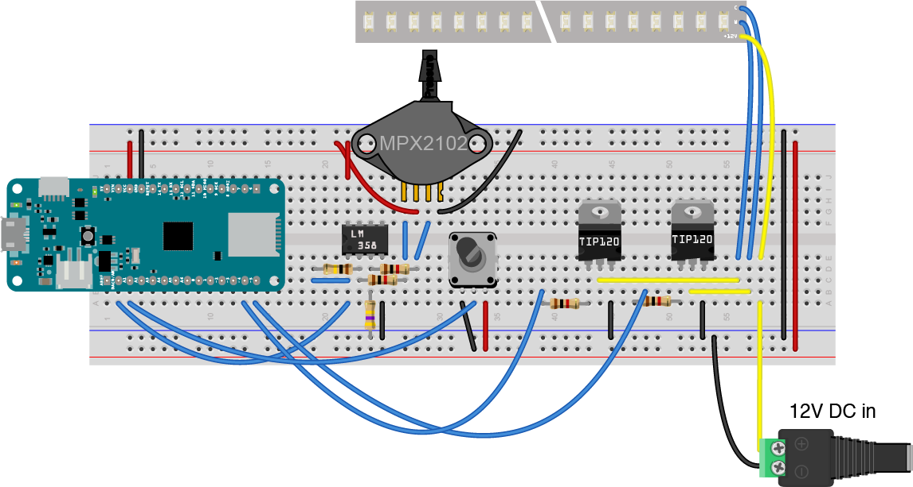
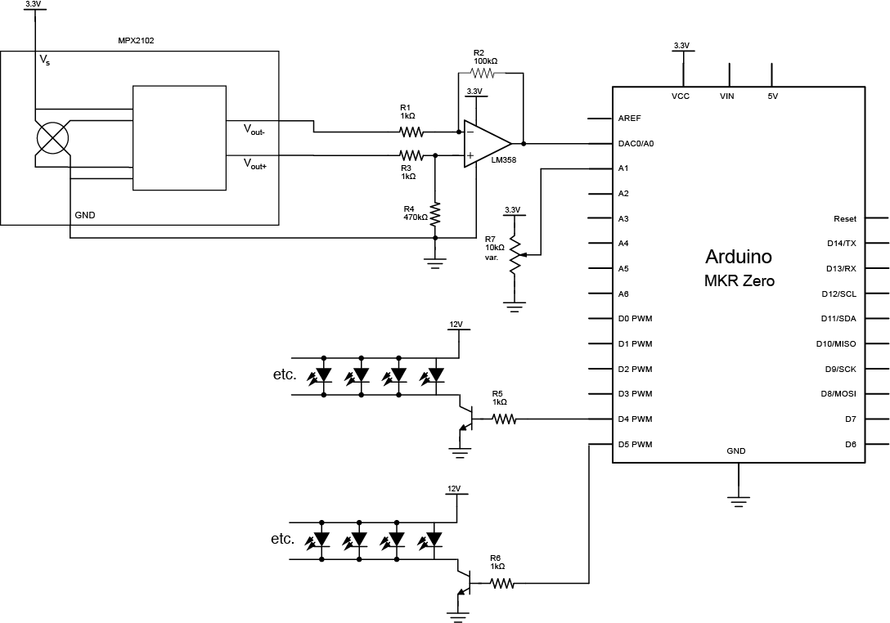

# Squeeze Bulb Lamp

This sketch and circuit are for a squeeze bulb lamp. It's made of a strip of 12-volt LEDs with two channels: warm white and cool white. The main control is a squeeze bulb attached to an air pressure sensor (an MPX2102, seen in Fig. 1 below). Squeezing the bulb increases the intensity of the LEDs by 10%. On their own, they fade by 1% every second. A potentiometer controls the balance of warm to cool LEDs. 

## The Circuit
Figures 1 and 2 below show the circuit. The sensor circuit is based on my MBX2102 pressure sensor example. The components are:

* a MKR Zero microcontroller
* a strip of 12-volt LED lights with two channels, warm and cool white
* 2 TIP120 transistors to control the strip
* an MPX2102 pressure sensor
* an LM358 op amp to read the sensor
* 1 10-kilohm potentiometer 
* 4 1-kilohm resistors
* 1 100-kilohm resistor
* 1 470-kilohm resistor
* 1 12-volt DC powee supply. Amperage depends on how many LEDs you are using. I used a 1.2A supply

The LED strip's' 12-volt connection is  connected to +12-volt power supply. The warm and cool connections are connected to the collectors of the two transistors. The emitters of the transistors are connected to ground, and the bases of the transistors are connected to pins D4 and D5 of the MKR Zero, respectively, through 1-kilohm resistors. The ground of the 12-volt power supply is connected to the ground of the microcontroller as well. 

The LM358 op amp is powered from the Vcc pin of the MKR Zero, so the voltage across the op amp is 3.3V. Pin 8 is the op amp's Vcc pin, and pin 4 is the ground. The inverting and non-inverting inputs of the op amp (pins 2 and 3) are connected to the pressure sensor's outputs through 1-kilohm resistors. A 100-kilohm resistor is the feedback resistor, connecting the op amp's output (pin 1) to the inverting input (pin 2). A 470-kilohm resistor is connected from the non-inverting input (pin 3) to ground. The op amp's output (pin 1) is connected to pin A0 on the microcontroller (pin 2). The sensor is also connected to ground and Vcc on its pins 1 and 3, respectively.

The potentiometer's two outside pins are connected to Vcc and ground, and its center pin is connected to pin A1 of the microcontroller (pin 3). 

Images made in Fritzing and Illustrator CS.

_Figure 1. Breadboard view of Squeeze bulb lamp circuit_

_Figure 2. Schematic view of Squeeze bulb lamp circuit_
