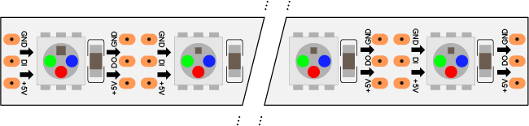

# Addressable LEDs
While many LED strip lights control all the LEDs in the strip at the same time, there are also a number of different addressable LED strips and modules on the market these days. Addressable LEDs are daisy chained together with common control, power, and ground lines, but can be turned on and dimmed individually. 

The most popular addressable LEDs on the market at the moment are variations on [WorldSemi](http://www.world-semi.com)'s WS281x LEDs, and [APA](http://www.neon-world.com/)'s APA102C LEDs. The main difference between them is the control interface. APA102C LEDs can be controlled using a standard SPI interface, while the WS281x LEDs have a proprietary single-wire data protocol.  The APA102C LEDs operate at a higher clock speed than the WS281x LEDs as well, meaning that you can refresh a long string of them faster, and you get less flicker from them when viewed through a video camera. 

You'll find a number of online sources of varying quality about addressable LEDs. The sources I find most useful are [Tim's Blog](https://cpldcpu.wordpress.com/), [Sparkfun](https://learn.sparkfun.com/tutorials/ws2812-breakout-hookup-guide/all), [Adafruit](https://cdn-learn.adafruit.com/downloads/pdf/adafruit-neopixel-uberguide.pdf), and the manufacturer's sites [APA](http://www.neon-world.com/) and [WorldSemi](http://www.world-semi.com). 

Although the notes here refer mainly to addressable RGB LEDs,  You can also find WS281x and APA102 variations that contain RGBW LEDs and WWA LEDs. It's worth shopping around to find what you need.

## Addressable LED Libraries

There are a few Arduino-compatible libraries for both types of LEDs. Adafruit's [NeoPixel library](https://github.com/adafruit/Adafruit_NeoPixel) works for the WS281x LEDs and their [DotStar library](https://github.com/adafruit/Adafruit_DotStar) works for the APA102C LEDs. The [FastLED library](http://fastled.io/) works for both. The examples in this repository rely mainly on the NeoPixel and DotStar libraries. While the FastLED library offers some additional features, the Adafruit libraries tend to be simpler to understand and use. Their APIs are clearer. Contrary to others' reports, I haven't found a significant speed difference between the Adafruit libraries and the FastLED library. There is  a [C library for 8-bit AVR microcontrollers](https://github.com/cpldcpu/light_ws2812) on Tim's Blog as well.

## WorldSemi Addressable LEDs

WorldSemi's WS281x LEDs are perhaps the most popular among hobbyists currently. Adafruit branded them as **NeoPixels**, so you'll often hear them referred to as such. The typical WS281x strip looks like Figure 1.

_Figure 1. A typical WS2812B LED strip. This drawing, by Adafruit for [Fritzing](http://www.fritzing.org), shows the typical configuration. Each LED has four lines: Data in (DI) Data Out (DO), voltage (5V or Vcc) and ground (GND). On most strips and rings of these LEDs, the pins are arranged with three connectors on each side of the strip: GND at the top, DI in the middle left, DO in the middle right, and 5V or Vcc at the bottom. Most strips have arrows on them to show the direction of the data signal. The wires coming off the strip vary in color, but many have red for Vcc or 5V, white for ground, and green for data in. The strips can usually be cut between the DI and DO connectors._ 

There are multiple variations on WorldSemi's addressable LEDs. The original models, the WS2801 and WS2811 are LED driver ICs, designed to control any LEDs you want to attach to them. The WS2801 is an earlier model, with separate clock and data lines, while the 2811 has one line for both. 

WorldSemi combined their 2811 driver chip with an RGB LED in a 5050 package to make the WS2812 LED. The more recent [WS2812B model adds some improvements](https://cdn.sparkfun.com/assets/learn_tutorials/1/0/5/WS2812B_VS_WS2812.pdf), like reverse voltage protection, 4 pins instead of 6, higher brightness, and improved thermal control. More recently, WorldSemi has also released the WS2813, which adds a second backup control line so that you don't lose a whole strip if one LED's control line is broken; and the WS2815, which is a 12V variation on the original model. 

Here's a [quickstart page of NeoPixel examples](WS281x/readme.md) to get you started. You can also find a number of simplified examples using the Adafruit NeoPixel library for the WS281x LEDs at [this link](https://github.com/tigoe/NeoPixel_examples). 

In summary:

* WS2801 - driver IC for LEDs, separate clock and data lines, low speed clock
* WS2811 - driver IC for LEDs, single clock and data line, higher speed clock
* WS2812 - combined driver IC and LED in a single package
* WS2812B - improved voltage protection, thermal control, brightness
* WS2813 - added backup data line
* WS2815 - 12V, and backup data line

The complete [WorldSemi digital LED line](http://www.world-semi.com/solution/list-4-1.html) is broader still, and worth reviewing if you're really into addressable LEDs.

You'll also see SK6812 LEDs on many sites. These are a popular clone of the WS281x line that are mostly compatible with the WorldSemi products. Tim's blog has a [detailed breakdown of the SK6812](https://cpldcpu.wordpress.com/2016/03/09/the-sk6812-another-intelligent-rgb-led/).

### WS281x Control Signal

The control signal for the WS281x LEDs is a non-standard protocol developed by WorldSemi. Sparkfun breaks it down pretty well in their [guide to the WS2812](https://learn.sparkfun.com/tutorials/ws2812-breakout-hookup-guide/all#ws2812-hardware-overview). The short version is that it's a 24-bit data protocol, 8 bits each for red, green, and blue. It's very time-dependent. A few microseconds can mean the difference between one color and another, so you need real-time (i.e. microsecond-level) control over the data signal. The NeoPixel and FastLED libraries do a good job outputting this signal accurately. 

_<u style="color: green">Protocol Note:</u> The WS281x protocol is what's called a **Non-Return to Zero**, or **NRZ** protocol, meaning that the high and low levels of the data signal do not indicate either one or zero. Instead, it's a fixed-frequency PWM signal, where a higher duty cycle indicates a 1, and a lower duty cycle indicaes a 0.  The details can be fond in [Adafruit's NeoPixel guide](https://cdn-learn.adafruit.com/downloads/pdf/adafruit-neopixel-uberguide.pdf) under "Writing Your Own Library"._

## APA Addressable LEDs

APA's addressable LEDs, sold by Adafruit as **DotStars** and by Sparkfun as **Lumenati**, are properly known as APA102C addressable LEDs. Figure 2 shows their typical strip configuration.

_Figure 2. A typical APA102C LED strip. This drawing, by Adafruit for [Fritzing](http://www.fritzing.org), shows the typical configuration. Each LED has six lines: Data in (DI), Clock In (CI), Data Out (DO), Clock Out (CO), voltage (5V or Vcc) and ground (GND). On most strips and rings of these LEDs, the pins are arranged with four connectors on each side of the strip: Vcc at the top, CI in the upper middle left, DI in  the lower middle left, CO in the upper middle right, DO in the lowed middle right, and GND at the bottom. Most strips have arrows on them to show the direction of the data signal. The strips can usually be cut between the DI/CI and DO/CO connectors._ 

As mentioned above, APA's [APA102](https://cpldcpu.files.wordpress.com/2014/08/apa-102-super-led-specifications-2013-en.pdf) and [APA102C](https://cpldcpu.files.wordpress.com/2014/08/apa-102c-super-led-specifications-2014-en.pdf) LEDs use a stadard SPI control interface and have a higher clock rate than the WS281x LEDs. Since they use SPI, they require separate data and clock lines in addition to power and ground lines. These LEDs are useful for applications where you need a longer run of LEDs, because the higher speed timing affords a faster refresh of the whole run than the WS281x LEDs.  They're also less sensitive to timing differences than the WS281x LEDs. 

APA also makes the [APA104](https://www.sparkfun.com/products/15206), an addressable LED that's compatible with the WS281x LEDs. 

## Powering Addressable LEDs

Addressable LEDs have power requirements similar to LED strips. A typical addressable LED might draw 60 mA when all  LED channels in the chip are turned on.  Both APA102 and WS281x LEDs are 5V parts (except the WS2815, which are 12V parts), so if you're using a 3.3V microcontroller, you need a separate 5V supply. 

The  WS281x LEDs are more forgiving of voltage differences on the data line, and will usually work with a 3.3V data signal, but the APA102 LEDs work best when you use a level shifter to convert your 3V data signals to 5V. 

## Other Control Options

LeDMX

FadeCandy

LEDLIghtingHut boards
