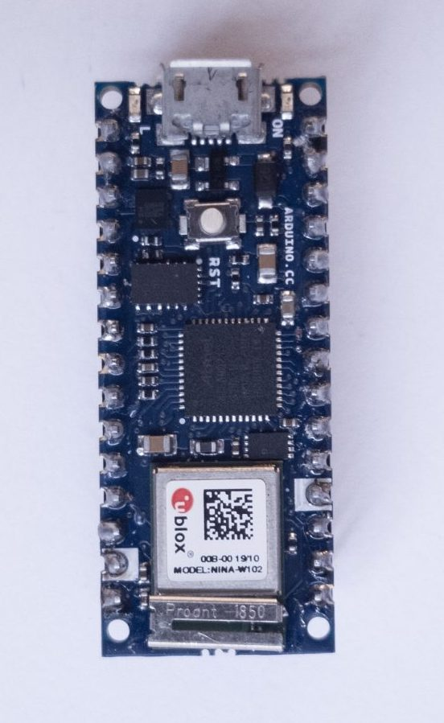
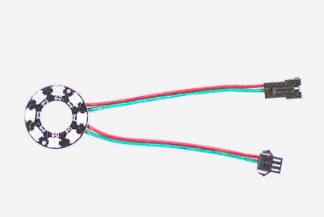
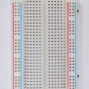
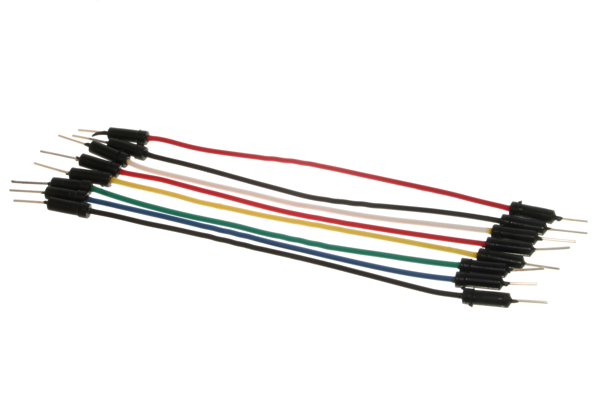
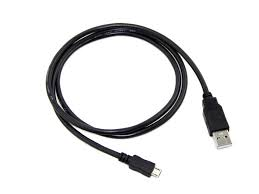
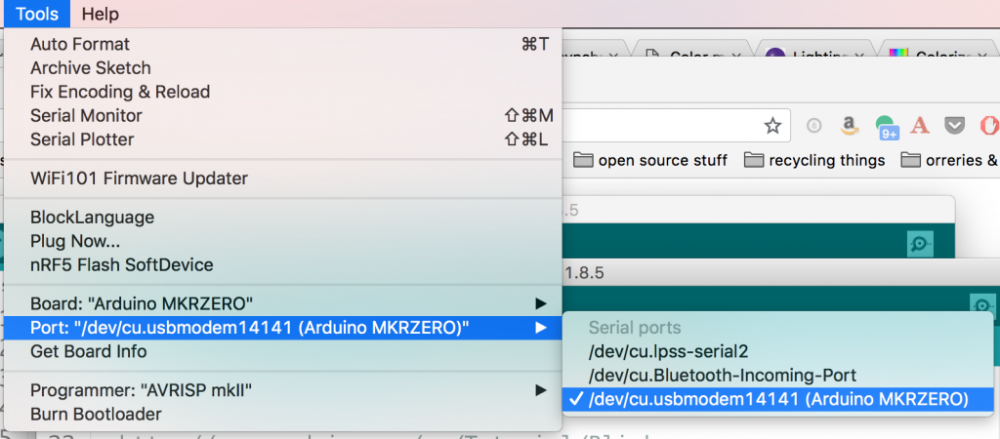
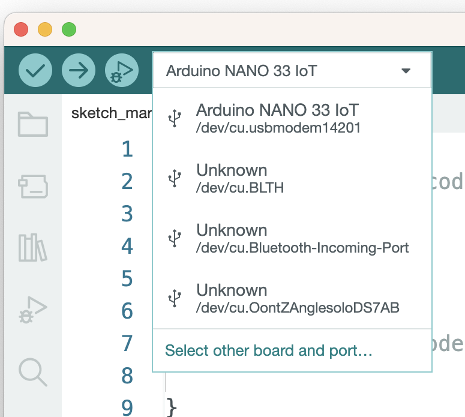
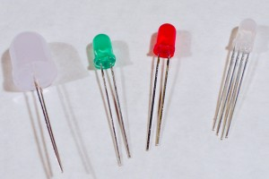
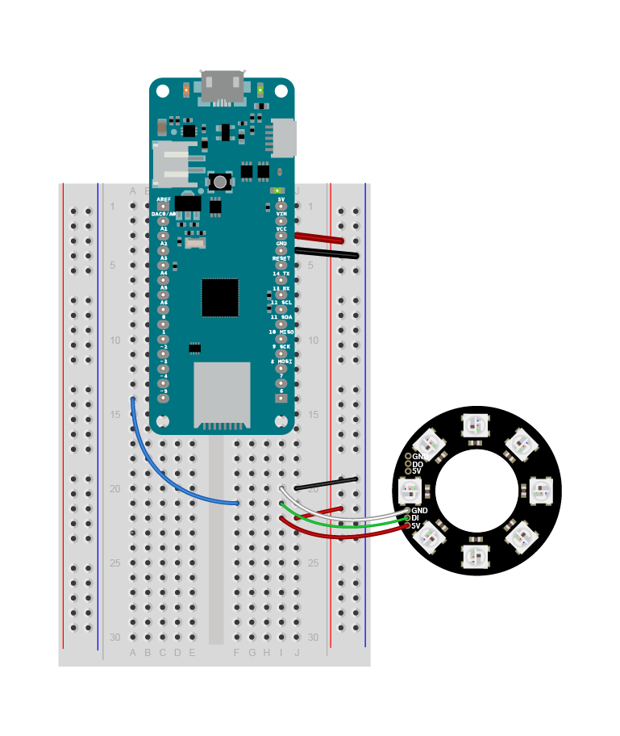

# Making Electronic Candles

Electronic candles are common in restaurants and bars these days, and they’re usually pretty low-fidelity representations of the behavior of real candles. It’s possible to make them with more complex behaviors, and it’s a good way to learn about addressable, LEDs. What follows is an introduction to addressable LEDs, using electronic candle-making as an application through which to learn. In the process, you’ll learn a bit about how colors are reproduced using LEDs and computation, and hopefully a few things about diffusion and reflection as well.

## What You Need to Know

In order to make the most of this tutorial, you should know what a [microcontroller](https://itp.nyu.edu/physcomp/lessons/microcontrollers-the-basics/) is, what the [Arduino](https://www.arduino.cc/) microcontroller programming environment is, and how to use it, [at least at a beginning level](https://itp.nyu.edu/physcomp/labs/labs-arduino-digital-and-analog/digital-input-and-output-with-an-arduino/). You should [download and install the Arduino IDE](https://www.arduino.cc/en/Main/Software) on your computer to follow along with the programming below. The [ITP Intro to Physical Computing](https://itp.nyu.edu/physcomp/lessons/#Microcontroller_Fundamentals) Topics and Video Links offer helpful background if you’re new to electronics and microcontrollers.

## Equipment You’ll Need

To follow along with this tutorial, you’ll need:

Figures 1-5 show the parts you’ll need for this exercise. Click on any image for a larger view.

<a href="img/candles/arduino-nano-33-iot.jpg" alt="Arduino Nano 33 IoT" width="75%" target="_blank"></a>

_Figure 1. Arduino board. Shown here is the Nano 33 IoT._

An Arduino-compatible microcontroller. Everything you’ll see here works on all models including the [Uno](https://docs.arduino.cc/hardware/uno-rev3), [Nano 33 IoT](https://docs.arduino.cc/hardware/nano-33-iot) and [Nano Every](https://docs.arduino.cc/hardware/nano-every), adn the [MKR boards](https://docs.arduino.cc/hardware/mkr-zero). 

<a href="img/candles/LED_ring.jpg" alt="LED Ring" width="75%" target="_blank"></a>

_Figure 2. Addressable LED Ring or module_

A set of WorldSemi addressable LEDs, the WS2812/SK6812 types. You can buy these from many retailers. Adafruit’s [NeoPixel](https://www.adafruit.com/product/2226) line are all compatible, as are SparkFun’s [LilyPad Pixel Board](https://www.sparkfun.com/products/13264) Seeedstudio’s [WS2812 offerings](https://www.seeedstudio.com/s/ws2812.html),  and many others. Here is a [quickstart guide to the NeoPixel library](https://tigoe.github.io/LightProjects/WS281x/).


<a href="img/candles/breadboard_short-e1532116106284-150x150-1.jpeg" _target="blank"></a>

_Figure 3. Solderless Breadboard_

<a href="img/candles/hookup_wires.jpg" alt="Hookup wires" width="75%" target="_blank"></a>

_Figure 3. Hookup wires_

<a href="img/candles/microUSB.jpg" alt="microUSB cable" width="75%" target="_blank"></a>

_Figure 5. microUSB cable_

A solderless breadboard, some jumper wires, and a USB cable to match your Arduino.

You'll also need a personal computer with the Arduino software installed.

When you start making a housing for your candle, some material for diffusing and reflecting the light will be useful as well: paper, cloth, glass, plastic, whatever strikes your fancy.

## Candle Flames and Artificial Sources

If you watch a candle flame over time, you’ll see many colors in it: pale yellow-orange in the tip, fading to orange towards the base, with hints of blue or green near the wick; perhaps an orange or reddish color at the top of the wax of the candle. All of these blend together in the flame, more so when you see them reflected through a frosted candle base or on a nearby surface. A slight breeze will change the mixture of the colors and the rhythm of their change. These colors are made of different wavelengths of light, determined by the material that’s burning and the material through which it’s refracted or off of which it’s reflected. Re-creating this feeling using artificial light sources requires multiple sources mixed together. It can be done by controlling the color and intensity of multiple light-emitting diodes, or  LEDs, using a microcontroller, a tiny, simple computer used to control physical devices.

## Turning On The LEDs

To get started, download and install the [Arduino microcontroller integrated development environment (IDE)](https://www.arduino.cc/en/software) on your computer. From the IDE’s Tools menu, choose _Manage Libraries…_ then search for and install the Adafruit NeoPixel library. If you’re using the Nano 33 or any of the MKR boards you can use the Adafruit NeoPixel DMA library instead. The library manager will automatically install the library into the IDE.

There are many different models of Arduino and compatible microcontroller boards. Any of them will work for this exercise. Figures 6 through 8 show breadboard layouts for the MKR boards, the Nano boards, and the Uno.

<a href="img/candles/LabTemplate_bb.png" alt="Arduino Uno next to a breadboard" width="75%" target="_blank"></a>

_All circuit board images made with [Fritzing](https://www.fritzing.org)_

_Figure 6. Arduino Uno next to a breadboard. Pin function numbers can be found at [this link](https://docs.arduino.cc/hardware/uno-rev3). Wires extend from the 5V and Ground pins of the Uno to the breadboard's vertical rows on the left hand side. These form voltage and ground buses. Wires connect the vertical rows on the left side with those on the right side so that both sides of the breadboard have voltage and ground buses._ 

If you’re using a MKR or Nano board or  plug it into a solderless breadboard as shown in Figures 7 and 8. Don’t leave it in the black foam in which it’s shipped. This foam is conductive foam, to protect the board during shipping, but it will damage the board if you power it while it’s in the foam. You can find typical breadboard layouts for the Uno, Nano, and MKR boards at [this link](https://itp.nyu.edu/physcomp/labs/breadboard-layouts/). 

<a href="img/candles/LabTemplateNanoShort_bb.png" alt="Arduino Nano 33 IoT mounted on a breadboard" width="75%" target="_blank"></a>

_Figure 7. Arduino Nano 33 IoT mounted on a breadboard. Physical pins are numbered in a u shape from top left. Pin function numbers for the Nano 33 IoT can be found at [this link](https://docs.arduino.cc/hardware/nano-33-iot), and for the Nano Every at [this link](https://docs.arduino.cc/hardware/nano-every). The pin arrangement are the same for all Nanos. Wires extend from the 3.3V and Ground pins of the Nano (physical pins 2 and 14, respectively) to the breadboard's vertical rows on the left hand side. These form voltage and ground buses. Wires connect the vertical rows on the left side with those on the right side so that both sides of the breadboard have voltage and ground buses._ 

<a href="img/candles/MKR_bb.png" alt="Arduino MKR Zero mounted on a breadboard" width="50%" target="_blank"></a>

_Figure 8. Arduino MKR Zero mounted on a breadboard. Physical pins are numbered in a u shape from top left. Pin function numbers for the MKR Zero can be found at [this link](https://docs.arduino.cc/hardware/mkr-zero). Wires extend from the 3.3V and Ground pins of the Nano (physical pins 26 and 25, respectively) to the breadboard's vertical rows on the right hand side. These form voltage and ground buses. Wires connect the vertical rows on the right side with those on the left side so that both sides of the breadboard have voltage and ground buses._ 

Once you’ve arranged your Arduino with a solderless breadboard, plug it into your computer’s USB port.

Now it’s time to light your first LED. Most Arduino and Arduino-compatible boards come with a built-in LED. Click the File menu, then Examples, then _01\. Basics_, then _Blink_. This will open a new file that looks something like this:

```
// the setup function runs once when you press reset or power the board
void setup() {
  // initialize digital pin LED_BUILTIN as an output.
  pinMode(LED_BUILTIN, OUTPUT);
}

// the loop function runs over and over again forever
void loop() {
  digitalWrite(LED_BUILTIN, HIGH); // turn the LED on (HIGH is the voltage level)
  delay(1000); // wait for a second
  digitalWrite(LED_BUILTIN, LOW); // turn the LED off by making the voltage LOW
  delay(1000); // wait for a second
}
```

Click the _Tools_ menu, then click _Board:_ and choose the name corresponding to your board. The MKRZero and Nano 33 IoT boards can be found under the _Arduino SAMD Boards_ submenu. The Nano Every is under _Arduino MegaAVR boards_. If your board is not in the menu, choose the Boards Manager from that same menu and search for the type of board you’re using and install it. 

When you’ve got the board selected, click the _Tools_ menu again, then click _Port:_ and choose the port with the name corresponding to your board. For example, the one shown in Figure 9 is called _/dev/cu.usbmodem14141 (Arduino MKRZERO)_.

Note: in the Arduino IDE version 2.0.0 and later, the board and port should show up in the board menu of the Sketch window as long as the IDE recognizes your board. Figure 10 shows the 2.0 Board/Port menu in the sketch window. 

<a href="img/candles/Tools_menu-1024x450.png" target="_blank"></a>

_Figure 9. Tools menu of the Arduino IDE_

<a href="img/candles/IDE-20-board-port-menu.png" target="_blank"></a>

_Figure 10. Board and port menu in the Sketch window of the Arduino IDE 2.0 and later._

When you’ve picked the right board and the right port, click the Upload button on the toolbar as shown in Figure 11. You can also type command-U (MacOS) or control-U (Windows):

<a href="img/candles/upload_button.png" target="_blank"></a>

_Figure 11. Upload button on the Arduino tool bar_

The IDE will now compile your Blink program to a binary file,  transfer it to the Arduino, and start running it. You should see the builtin LED on your board blinking, as seen in Video 1 below. Congratulations!

<a href="https://vimeo.com/277706585" target="_blank">Video 1: The LED Blinking on a MKRZero</a>

Controlling a few LEDs at a time on an Arduino is simple. You attach one leg of the LED (the longer leg, called the _anode_) to one of the input-output (I/O) pins through a 220-ohm resistor, attach the other leg (the shorter leg, or _cathode_) and apply voltage to the pin to turn the LED on. The `digitalWrite()` command does this. `digitalWrite(pinNumber, HIGH)` applies voltage, and `digitalWrite(pinNumber, LOW)` turns it off. Each LED is just one color, though. If you want to change the color of your light, you need multiple LEDs. To mix red, green, and blue into a range of colors, for example, you need three LEDs. Fortunately, you can buy components that have multiple LEDs in one package. A typical RGB LED might look like those in Figure 12:

<a href="img/candles/leds1-300x200.jpg" target="_blank"></a>

_Figure 12. Four LED components. The one on the right is an RGB LED. Note that it has four legs. It contains three LEDs in the one package. The long one is a common cathode. The three others are the anodes for the red, green, and blue LEDs in the package._

To control an RGB LED like the one shown on the right above, you need three I/O pins. The common cathode is attached to ground. As you can imagine, you run out of I/O pins fast if every LED needs its own pin. This is where **[addressable LEDs](addressable-leds.md)** come in handy. Addressable LEDs or programmable LEDs as they're also called, are components containing an LED and a very limited processor to control them. They’re chained together so that you can control many of them from one I/O pin. Your microcontroller sends a series of electronic pulses on the I/O pin, and the string of addressable LEDs interprets the pulses to know which LED to turn on, and how bright. Each LED in the chain (for example, the ring shown in Figure 4 above) gets its own address, and you send pulses indicating the address, then the levels for each color channel at that address. This communication is a form of [serial communication](https://itp.nyu.edu/physcomp/lessons/#Serial_Communication), a common way that computers talk to each other. You can think of each LED as its own tiny computer, listening for messages from your master computer (your Arduino).

The addressable LEDs you’re using are a variant of [WorldSemi’s WS2812 LEDs](http://www.world-semi.com/products/index.html). They listen for a specific protocol set by the manufacturer, and you can send it from your microcontroller using the Adafruit NeoPixel library which you installed earlier. Disconnect your board from the computer _**(Always disconnect your microcontroller from power before changing the circuit!)**_ Then connect your addressable LED ring to the board as shown in Figure 13 below, with the voltage input pin of the LEDs attached to the Arduino’s Vcc, the GND pin attached to ground, and the DI pin attached to digital pin 5. You can use this same (addressable LED voltage, ground, and control on pin 5) arrangement on all Arduino models:

<a href="img/candles/MKRZero-Neopixel-1.png" target= "_blank"></a>

_Figure 13. MKRZero with addressable LED ring_

The current available from the microcontroller’s Vcc pin isn’t much, but it’s enough to supply seven or eight addressable LEDs. You’ll be controlling the LEDs from pin 5 of the microcontroller. Now open a new file in the IDE, and enter the following program:

```
#include <Adafruit_NeoPixel.h>
const int neoPixelPin = 5;  // control pin
const int pixelCount = 8;    // number of pixels

// set up strip:
Adafruit_NeoPixel strip = Adafruit_NeoPixel(pixelCount, neoPixelPin, NEO_GRB + NEO_KHZ800);

void setup() {
  strip.begin();    // initialize pixel strip
  strip.clear();    // turn all LEDs off
}

void loop() {
  int red = 255;   // set colors
  int green = 0;
  int blue = 0;

  // loop over all the pixels:
  for (int pixel = 0; pixel < pixelCount; pixel++) {
    strip.setPixelColor(pixel, red, green, blue);// set the color for this pixel
    delay(500);
    strip.show();    // refresh the strip
  }
  delay(1000);
  strip.clear(); 
}
```

If you want to test each of the LEDs and colors in a NeoPixel module, here is a [link to an example](https://github.com/tigoe/NeoPixel_examples/blob/main/NeoPixelTester/NeoPixelTester.ino) that cycles through red, green, blue, and white, one pixel at a time.

Video 2 below shows the LEDs of an addressable ring turning on in red, one at a time. The Arduino in that video is running the code above.

<a href="https://player.vimeo.com/video/277706645?h=7e206c39b5" target="_blank">Video 2: Addressable LEDs turning on one at a time</a>

This program contains the basic elements of any program for controlling neoPixel addressable LEDs:

1.  Include the library
2.  Set the I/O pin to control them from
3.  Set the number of addressable LEDs you plan to control
4.  Establish the group of LEDs as a set (`strip` in this case) and set its parameters
5.  Initialize the set of LEDs in the `setup()` function
6.  In the main loop, use `strip.setPixelColor()` to change the color of any given LED. Each channel’s brightness ranges from 0-255.
7.  refresh the whole set of LEDs with `strip.show()`

Although the LEDs you’re using are likely just RGB LEDs, they’re not your only option. Addressable LEDs come in other options.  RGB+white and white-white-amber (WWA), which have a cool white, a warm white, and an amber LED, are available as well.  And the NeoPixel library isn’t your only option for programming them. More experienced coders may want to look at the [FastLED library](http://fastled.io/), or the [light\_WS2812 library](https://github.com/cpldcpu/light_ws2812). Most of the libraries will follow the same pattern of control shown above.

The magic in creating movement, color change, and animation lies in how you time the changes between colors of each given LED.  Play around with these parameters in the previous program and try a few variations of your own, to see what you can do. Try making your LED fade from orange (which is a combination of red and green and blue, like 191, 104, 38) to a yellow (something like 205, 206, 36). Try writing a program to turn each of the LEDs in the ring a different color found in the candle flame.

_Note:_ the RGB color scheme used to set colors in web pages is identical to the scheme you use to set colors for these LEDs. Red, green, and blue are often encoded as hexadecimal numbers, so a string like 205, 206, 36 would be 0xCD, 0xCE, 0x24, usually written as #CDCE24 in HTML.

## Color Rendering With LEDs

Now that you can control your LEDs, it’s time to think about the colors in those candles again. How can you make the best fade from red to orange to yellow, with occasional flashes of blue or green?

LEDs emit different colors depending on the material from which they’re made. LEDs are made from materials like gallium arsenide, silicon carbide, gallium indium nitride, and others, mixed together in different ratios. [Electronics Tutorials](https://www.electronics-tutorials.ws/diode/diode_8.html) has a nice chart showing the common materials for different colors. What this means is that to recreate the flame colors, you need to find LEDs that produce the right wavelengths as the materials in your original candle, or you need to find LEDs that can mix together to give more or less the colors you want.  You can enhance the look by using reflectors and diffusers that highlight the colors you want, but you can’t reflect a color that’s not there to begin with. So the color range of your sources is important. In fact, artificial sources are rated by their **color rendering index (CRI)**, which is a measure of how well a given light source renders the colors of an object.

Most LED sources re-create a wide color spectrum by combining color sources that are spread across the color spectrum like the ones you have here: red, green and blue. Some sources will include a white LED as well.  Some specialty sources will include more than just these colors. For example, white LED lights commonly come in multiple variants of white to support fading the **color temperature** of the light. Color temperature refers to the warmth or coolness of a light source. The Kelvin scale for color temperature ranges from 1,500k– 2,000k for warm reddish sources to 2,500k– 3,000k for amber and yellowish sources to 3,000– 4,000k for so-called “natural” white sources (analogous to incandescent light blulbs) to 4,000k– 6,500k for cool blue whites and 6,500k and higher for sky blues. The higher the Kelvin temperature, the cooler the hue.

The ability to render a wide range of colors is a competitive advantage for lighting manufacturers. For example, ETC Theatre Lighting makes [sources with seven LED colors](https://www.etcconnect.com/Products/Entertainment-Fixtures/Desire-D40/Features.aspx), to create as wide a range of color rendering as possible. They know that stage lighting designers are used to working with a range of color, from the subtle warm glow of an incandescent source as it fades out to the harsh greenish-white glare of an arc lamp, and they design their lights to re-create these conditions.

## Color Models

When you think about mixing colors, you need a way to organize the colors so you can think about how to move from one color to another. Rune Madsen has an excellent chapter on color models and color spaces in his book [_Programming Design Systems_](https://programmingdesignsystems.com/) which I’ll borrow from here.  A **color model** is a representation of the color spectrum in multiple dimensions, depending on the parameters that you have to represent the spectrum. For example the **RGB color model** represents the color spectrum on three axes: red, green blue. This is the most commonly used model for lighting and for computer screens, which are made of lighting pixels. See Madsen’s [interactive model for RGB](https://programmingdesignsystems.com/color/color-models-and-color-spaces/index.html#rgb-cube) to visualize this. Printers often use a **CMYK color model**, in which color is represented on four axes, cyan, magenta, yellow, and black, for the ink colors often used in printing.

The RGB color model makes sense when you’re mixing red, green, and blue sources to make a color, but it can be challenging when you want to describe the changing hues of a source like a candle. For example, fading from yellow to orange to red and back requires you to mix red, green, and blue simultaneously to stay in the red-to-orange-to-yellow range. When changing between different hues, the **Hue-Saturation-Intensity (HSI)** is easier to work with. The HSI model maps [hue on a color cylinder](https://programmingdesignsystems.com/color/color-models-and-color-spaces/index.html#hsl-cylinder). Saturation of the color is mapped from no saturation (white) at the center of the circle to full saturation at the edge, and intensity, or brightness, is mapped in a third dimension.HSI is a variation on another model, **Hue-Saturation-Lightness (HSL)**. The **Hue-Saturation-Value (HSV) color model** is also similar, but the [height of the cylinder is intensity of color](https://programmingdesignsystems.com/color/color-models-and-color-spaces/index.html#hsv-cylinder), not intensity. When you’re thinking about changing colors of light, you often describe what you want using an HSL color model, as the description of the candle above does.

When your light sources have RGB controls but you want to describe your program using HSI, you have to convert from one to the other. This is what computers are good for. To convert between HSI and RGB, you could do the math yourself, or [use a color conversion calculator](http://colorizer.org/), or you could use the color conversion functions in the NeoPixel library. These functions do the math for you on the Arduino.

Here’s an example that uses the color conversion functions to fade from red to orange. Note how it requires changing only one number, the hue, even though that results in a change to red, green, and blue simultaneously. The code can also be found in this [gitHub repository](https://github.com/tigoe/NeoPixel_examples/tree/master/NeoPixelCandle0001):

```
#include <Adafruit_NeoPixel.h>

const int neoPixelPin = 5;  // control pin
const int pixelCount = 7;   // number of pixels
int change = 10;             // increment to change hue by

// set up strip:
Adafruit_NeoPixel strip = Adafruit_NeoPixel(pixelCount, neoPixelPin, NEO_GRBW + NEO_KHZ800);

int h = 1000;  // hue
int s = 255;  // saturation
int i = 255;  // intensity

void setup() {
  strip.begin();  // initialize pixel strip
  strip.clear();  // turn all LEDs off
  strip.show();   // update strip
}

void loop() {
  // create a single color from hue, sat, intensity:
  long color = strip.ColorHSV(h, s, i);

  // loop over all the pixels:
  for (int pixel = 0; pixel < pixelCount; pixel++) {
    strip.setPixelColor(pixel, color);
    strip.show();  // update the strip
    delay(100);
  }

  // increment hue to fade from red (0) to reddish orange (15) and back:
  h = h + change;
  if (h < 0 || h > 2400) {
    change = -change;
  }
}
```

The HSV color space makes it much easier to change individual colors across a range of hues without having to work out the color mixing to RGB yourself. Video 3 shows the program in action.

<a href="https://player.vimeo.com/video/277706591?h=4550d579f1" target="_blank">Video 3. A ring of addressable LEDs fading from red to orange</a>

Try modifying the program above to create different hues, and then write your own program to fade between them.

## Reflection, Refraction, Diffusion and Design

Making a light is more than just turning on and off the LEDs. It’s about the surfaces through which the light is refracted, and off which it’s reflected. What makes any light interesting, in the end, is what it illuminates, and how it does it. There are a few constraints that can be useful in thinking about this:

-   Pick your  color palette and work with it. A color palette sets the mood. Rainbow color scrolling is not a design choice, it’s a default program for addressable LEDs. If you’re not confident, start with a tool like [color.adobe.com](https://color.adobe.com/explore/?filter=most-popular&time=month) to make a color scheme.
-   Don’t show the source: diffuse it, reflect it, or redirect it in some way or another. Notice how the videos above do not show the LEDs themselves, only their reflection off paper. This is much more pleasing to the eye than looking at the sources directly.
-   Draw attention to the light on the subject, not the light itself

## A Few Examples

The first two videos belows give you some ideas for what’s possible with addressable LEDs. Video 4 shows one of these addressable pixel rings inside a hand-crafted tea candle holder made from glazed ceramic. The glaze of the ceramic makes a nice reflection. 

<a href="https://player.vimeo.com/video/278016455" target="_blank">Video 4. A NeoPixel ring fading in a candle holder. Video by Denise Hand.</a>


<a href="https://player.vimeo.com/video/278016480" target="_blank">Video 5. A NeoPixel ring fading in a candle holder. This view shows the interior of the candle holder. Video by Denise Hand</a>

In the videos 6 and 7, notice how the bristles of the paint brush blur the light and spread it out so that, in the second video, you don’t notice the LEDs at all, only the candle flame shape that it forms. Strong lines in a diffusion spread the light perpendicular to the direction of the lines, so the bristles in these videos help to spread the light here horizontally, blurring the distinction between one pixel and the next.

<a href="https://www.instagram.com/p/BQHqdKDAhuR/" target="_blank">Video 6. A paintbrush diffusing LEDs. Video by Hayeon Hwang</a>

<a href="https://www.instagram.com/p/BQPm1L5ARls/" target="_blank">Video 7. A paintbrush diffusing LEDs. This one has the bristles upright and looks more like a candle with a flame on top. Video by Hayeon Hwang</a>

Video 8 uses [dichroic filters](https://www.decorativefilm.com/3m-fasara-dichroic-and-speciality),  thin films which selectively pass a small range of colors of light while reflecting other colors. The contrast of the deep purple light passed through the filter and reflected off the wall with the bright white light in the center creates drama.

  
<a href="https://www.instagram.com/p/BSibfEigSb8/" target="_blank">Video 8. Dichroic film diffusing an LED. The dichroic film makes a rainbow of colors from white light. Video by Hayeon Hwang</a>

In video 9, a thick sheet of paper with holes blocks most (though not all) of the light, and allows some through to be further diffused by a lightweight silk material. The combination creates a sense of depth, and the light coming through the silk feels ephemeral compared the the more solid light of the inner polka-dot cylinder. This soft, out-of-focus [bokeh light](https://photographylife.com/what-is-bokeh) is a popular photographic trope.

  
<a href="https://www.instagram.com/p/BRpRV9Egdbv/" target="_blank">Video 9. Bokeh light candle. Video by Hayeon Hwang</a>

Video 10 is a candle that uses a wooden holder with holes, and creates a nice movement through variable changes in the LEDs. Since they change at varying speeds, the candle feels more “flickery”  and lively than some of the other candles:

<a href="https://player.vimeo.com/video/203957964" target="_blank">Video 10. Wooden candle holder by Rushali Paratey</a>