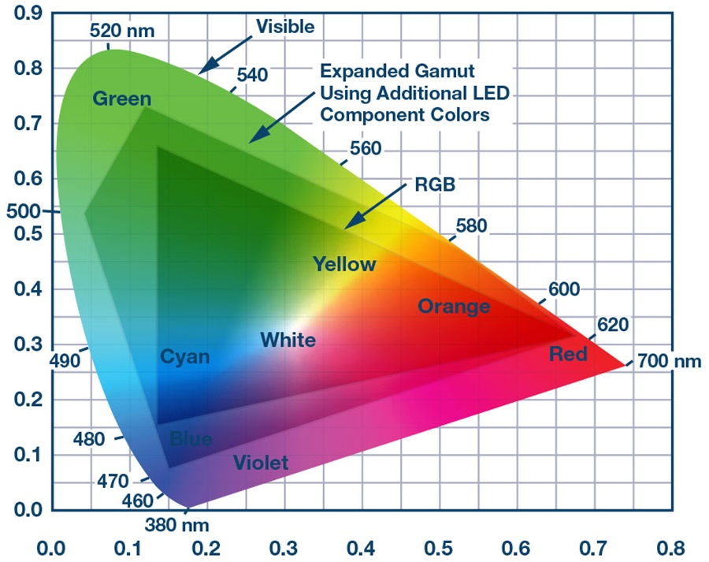
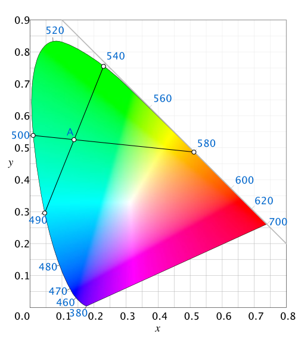

# Chromaticity

Chromaticity diagrams attempt to show all the possible colors range of spectral colors (which are colors produced by a single wavelength of light) at a given intensity and how they can be combined to produce other colors. Most chromaticity diagrams you encounter will look like Figure 1, a curved shape with a flat edge, positioned on an X-Y Cartesian graph, with the flat edge on an angle on the right side of the graph:

_Figure 1. The CIE1931 Chromaticity Diagram. Image from Wikimedia._

The curve of a chromaticity diagram contains all the spectral colors visible to humans, typically from about 380 nanometers to 780 nanometers. **Spectral colors** are colors produced by a single wavelength of light. The flat edge on the right side represents colors that can only be produced by mixing the two colors at the extreme edges of the  spectrum. Since the ends of the spectrum are red and blue, this line represents a line of purple hues. 

If you pick any two colors on the spectral curve and draw a line between them, that line represents all the colors that can be created by combining those two wavelengths. The position between the two colors reflects their relative intensities. The midpoint of the line is the color that's an even balance of both colors. 

## What's With the Shape of the Chromaticity Diagram?

Think of the shape of the chromaticity diagram as a map. Maps don't always represent the physical distance between points. Many maps distort distance in order to show you relationships. Take Massimo Vignelli's [1972 New York City Subway map](https://www.nytimes.com/2012/08/06/arts/design/the-subway-map-that-rattled-new-yorkers.html), for example. It has little to do with the geographic distances in New York City, but it tells you how to get from one place to another. Similarly, chromaticity diagrams tell you what you get between one color and another.

Okay, you're thinking, but why is the CIE1931 chromaticity diagram (Figure 1) different from the CIE1976 diagram (Figure 2)?  They represent different ways of measuring color. CIE1931 is based on the perceptual sensitivity of the human eye, based on experiments on a sampling of subjects. CIE1976 attempts to make perceptually similar colors more easily computable. It's modeled on colors that could be produced using sources at the time. CIE1976 is based on the work of David Macadam, who figured out how to calculate regions of the chromaticity graph which are perceptually indistinguishable from each other. These regions are now called *Macadam ellipses*.  In CIE1931, these ellipses are different sizes, depending on the color range you are in. In CIE1976, the sizes of these ellipses are more uniform. Figures 3 and 4 show the two diagrams with Macadam ellipses superimposed on them.  Here's a [good explanation of Macadam's work](https://lightquality.blog/2018/01/08/macadam-ellipses-and-determination-of-tolerance-and-chromaticity-changes-of-light-emitted-by-lamps/). 

_Figure 2. The CIE1976 Chromaticity Diagram. Image from Wikimedia_

_Figure 3. The CIE1931 Chromaticity Diagram with Macadam Ellipses. Image from [lightquality blog](https://lightquality.blog/). They have different areas depending on which region of the graph they are in._

_Figure 4. The CIE1976 Chromaticity Diagram with Macadam Ellipses. Image from [lightquality blog](https://lightquality.blog/). Ellipses in different regions of the graph are closer to the same area (if not shape)._

## Color Gamuts

A **color gamut** is all the available colors in a color space. Since the CIE1931 was based on human perception, it represents the gamut of all the colors a human can see (theoretically). If you take three spectral colors and draw a triangle between them, you get a color gamut of all the colors you can reproduce using just those three wavelengths. Figure 5 shows the sRGB color gamut, for example. This is a range of colors that are reproducible on most computer monitors. It depends on the wavelengths produced by the phosphors of the monitor. 

_Figure 5. The sRGB Chromaticity Diagram. Image from Wikimedia_

## Color Reproduction 

In Figure 5 you can see that an RGB monitor can't produce all the colors in the CIE1931 diagram, just a truncated triangle in the middle. It misses much of the pale blue and vivid green space, and the deep reds and maroons on the bottom right corner of the CIE1931 diagram in Figure 1. It  gives you an idea why objects lit by a computer monitor typically look duller than they might under high-CRI lights or sunlight. Many of the objects' colors are not being reflected. It gives you an idea why lighting and monitor manufacturers are interested in LED sources that can produce a wider range of wavelengths.

Figure 6, from Analog Devices, shows the color gamut that can be produced from a light source with many LEDs of different wavelengths. Adding lime green, maroon, or deep blue or UV LEDs expands the color gamut from a thin triangle in the middle of the curve (shown in Figure 6) to a polygon encompassing more of the curve. 

_Figure 6. Chromaticity Diagram of multi-wavelength LED sources. Image from [Analog Devices](https://www.analog.com/en/technical-articles/control-color-of-led-stage-and-architectural-lighting-easy-accurate-13-bit-color.html)._

# Fading and Transitions

It's worth noting that any color in a chromaticity diagram can theoretically be produced by multiple different combinations of wavelengths. Figure 5 shows how you might arrive at color A, a pale blue-green, by combining 490nm and 540nm, or by combining 500nm and 580nm. 

_Figure 7. Combining colors on the chromaticity diagram. Image adapted from Wikimedia._

Even though there is a point where these two lines meet, Figure 5 shows how the respective fades from one pair to the other are somewhat different. A fade from 500nm to 580nm will pass through a yellow zone that the fade from 490nm to 540nm will never pass through. 

Chromaticity diagrams give you a way to think about a given color of light in terms of the wavelengths of which it's composed. Though a spectral power distribution diagram is more useful for analyzing the range of color frequencies producible by a light source (see [this page](light-rendering-indices.md) for more), these are more useful for thinking about synthesizing color. They can be particularly useful when you want to reproduce colors at the edges of the chromaticity curve, to see if they're producible within the gamut of your sources. They're also useful for thinking about fading light from one color to another. 

For more on this, see Chandler Abraham's essay *[A Beginner's Guide to (CIE) Colorimetry](https://medium.com/hipster-color-science/a-beginners-guide-to-colorimetry-401f1830b65a)* which covers everything mentioned here in more depth. 