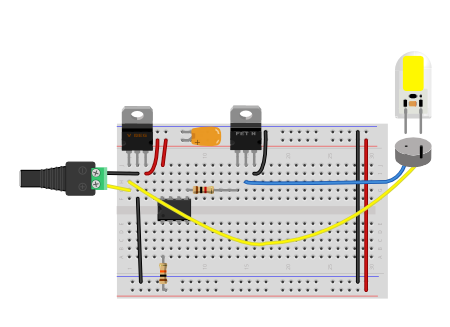

# Low-Voltage DC Lamps: Controller Options

As explained in the [Controlling Low-Voltage DC Lamps](led-lamps) page, control of low-voltage DC often involves driving the lamp through a transistor using pulse width modulation (PWM). This can be done either using a microcontroller with PWM capability, or by using a timer circuit like the 555 timer. If you are using a microcontroller, you could consider simplifying your circuit by using just the controller like the ATTiny84 or ATtiny85 rather than a full microcontroller module like the Arduino Uno, MKR family, or Nano 33 family. Following are summaries of the factors to consider for all these options, followed by more detailed discussion of each. 

### 555/556 Timer:

* Not programmable; harder to customize interaction
* Single channel of PWM (2 channels with 556)
* No advanced digital I/O (e.g. I2C, SPI, UART)
* Details of control circuit are less forgiving than microcontroller input
* Cost - $1-2 per unit

### ATTiny85/84:

* Programmable, but more steps than microcontroller module
* 2 channels of PWM (2 for ATTiny84)
* I/O: Analog, Digital, Software UART, SPI
* Control circuits simpler than timer circuits
* Cost: $1-2 per unit

### Microcontroller Modules:

* Programmable
* Multiple channels of PWM, depending on model
* I/O: Analog, Digital, Software UART, SPI, I2C, BLE, WiFi, USB, depending on model
* Control circuits simpler than timer circuits
* Cost: $15-50 per unit, depending on unit

## 555/556 Timer ICs

Electronic timers like the 555 and its companion the 556  are single-purpose integrated circuits (ICs) that can generate a variable pulsewidth output.  They are not programmable. The pulse width that they generate depends on the values of the resistors and capacitors that you attach to them. Their advantage is that they do not need to be programmed with firmware to work. They are also inexpensive. Their disadvantage is that they cannot work with advanced sensors, and you need a closer understanding the details of the analog circuitry attached to them in order to make them function properly.

It used to be the case that a 555 timer significantly cheaper than a microcontroller. However, microcontrollers have gotten cheaper, and nowadays, a very basic controller like the ATTiny85 is available for a similar price as a 555 timer, with much more potential functionality.

Figures 1 and 2 show a typical 555-based 12V DC control circuit in breadboard and schematic views. A 50-kilohm potentiometer is the user input, and a single pulsewidth module channel is the output. 

## Microcontrollers

There are countless different microcontrollers on the market, and pretty much all of them can generate a PWM signal. The Microchip Atmega family, on which much of the Arduino product line is based, is indicative of the range you might expect. The ATtiny85, one of the smallest in the family, has 8 pins. The Atmega328, the processor on the Arduino Uno, has 28 pins, similar to the SAMD21 processor on the Nano 33 IoT. 

The difference between various microcontrollers, besides the number of I/O connections, includes the communications protocols they can use, their processing power, and their memory. They all have tradeoffs. A small processor like the ATTiny85 may be small and inexpensive, but it lacks most of the features of an integrated module like the Uno or the Nano family. It has no asynchronous serial port, no I2C bus, and no WiFi or Bluetooth. It's got minimal memory. It can also take more work to program and debug as a result. But when all you need is a couple of PWM signals and a pushbutton or potentiometer input, these can be worthwhile tradeoffs. For many single or dual-channel DC lighting control projects, it can often do the job.

Figures 3 and 4 show a typical ATTiny85-based 12V DC control circuit in breadboard and schematic views. A single pulsewidth module channel is the output. Andy Sigler's notes on [programming the ATTiny using Arduino](http://homemadehardware.com/guides/programming-an-attiny85/) are useful in getting started with this microcontroller. 

### Microcontroller boards vs Microcontroller ICs

A commercial micrcontroller breakout board like the Uno, Nano, or any of the Arduino family or its immediate competitors, includes more than just the processor. It also includes the circuitry for the timing clock, a voltage regulator, and other circuitry to interface with USB, radios, and other I/O devices. This offers stability and convenience, at a cost. When you build your own version from a bare processor, you have to build this part of the circuit yourself. 

The [LED Lamp](led-lamps) and [LED Strip](led-strips) pages in this repository show circuits for controlling DC circuits from a microcontroller module such as the MKR, Nano, or Uno boards. 

The chart below compares a few models of simple microcontroller ICs, as well as a few microcontroller modules. 

## Microcontroller Comparison Chart

| Controller | Unit cost | PWM channels | Input channels |
|------------|-----------|------------------|--------|
| 555 timer | $1.38 | 1 | 1 analog or digital |
| ATtiny85 | $1.62&nbsp;* | 2 | 3 analog or digital, SPI | 
| ATtiny84 | $2.58&nbsp;* | 4 | 8 analog, 10 digital, SPI | 
| ATmega328 | $2.58&nbsp;* | 6 | 19 digital, 6 analog, I2C, SPI, UART | 
| Arduino Uno | $23.00 | 6 | 19 digital, 6 analog, I2C, SPI, UART
| Arduino Nano 33 IoT | $18.00 | 8 | 21 digital, 8 analog, I2C, SPI, UART, BLE, WiFi

`*` does not include clock or voltage regulation components 