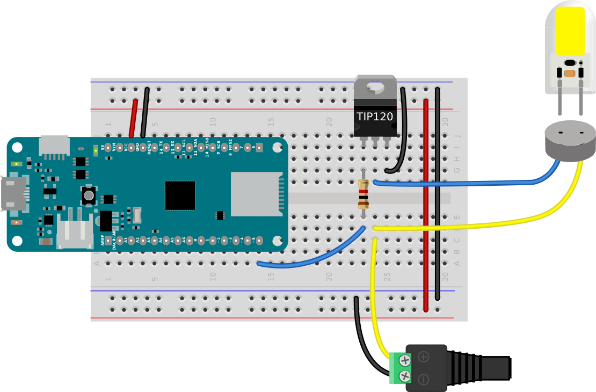
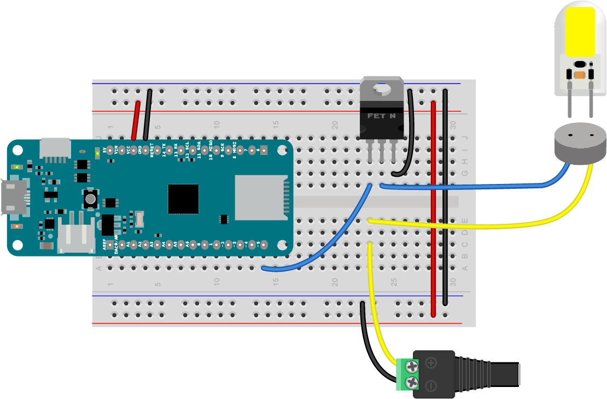

# Controlling Low-Voltage DC Lamps

The spread of LED lighting has made it much easier to create domestic lighting projects. Until recently, if you wanted to control the lights in your home or office, you needed a control circuit for high-voltage AC power. Although it is possible to control AC dimmer circuits from a microcontroller, it's both more complex and less safe than working with low-voltage DC circuits. In contrast, low-voltage LED lamps are relatively easy to control from a microcontroller. 

To control low-voltage DC lamps from a microcontroller, you'll need a separate power source, and a transistor that's matched to your voltage and current needs.

Be alert when shopping, as there are many LED lamps that operate on high-voltage AC on the market as well. These are not controllable using the method described here. 

## Electrical and Physical Characteristics
When you start to plan a DC lighting project, remeber the relationships between voltage, current, resistance, and electrical power:
````
voltage = current * resistance
````
and 
````
electrical power (wattage) = voltage * current
````
**Voltage** - The most common voltages for DC lamps are +12V, and +24V. These are higher than the operating voltage of microcontrollers, but well within range of many transistors.

**Current** - The current that a lamp needs should be listed in its technical specs, but often you'll only be given the wattage. If so, remember that `wattage = voltage * current`, and you can work out the current. For example, this [12-24V landscape bulb](https://www.superbrightleds.com/moreinfo/landscape-bulbs/gy635-led-landscape-light-bulb-40-watt-equivalent-bi-pin-led-bulb-450-lumens/4539/10110/#tab/specifications) operates at 12V and consumes 5 watts. That means its current is about 0.4 amps.

You should leave some overhead in choosing a power supply; 20% is a good number. For example, if your lamp need 0.4 amps, then pick at least a 0.5 amp supply. 

**Equivalent Wattage** - don't be fooled by this number. It's a measure of the equivalent incandescent lamp you'd need, but the number has no bearing on your circuit. 

**Lamp Shape and Base** - different lamps come in different shapes and sizes, and have different bases. Always match your base to your lamp. There's a great guide to standard base shapes and their names in _Light Sources, Second Edition: Basics of Lighting Technologies and Applications_, page 47, by Spiros Kitsinelis. You can find a partial summary on my [lighting terminology page](https://itp.nyu.edu/classes/light/lighting-terminology/).

Bases you'll commonly find in DC lamps are the smaller screw bases, the bi-pin base, the twist-lock base, and the wedge base. Bulbs.com has an excellent [chart of bases](https://www.bulbs.com/learning/basechart.aspx). They also have a good [lamp size and shape chart](https://www.bulbs.com/learning/shapesandsizes.aspx). Generally the larger lamp sizes are limited to high voltage lamps, but you'll see candleabra lamps, MR-16 lamps like the JC bi-pin and the wedge frequently in 12V and 24V LED lamps. 

<u style="color:green;">Size note:</u> The number in most lamp sizes refers to eighths of an inch. For example, a PAR64 lamp is a Parabolic Aluminized Reflector (PAR), 64/8" (8 inches) in diameter. An MR-16 is a Metallic Reflector (MR), 16/8" (2 inches) in diameter. 

## Light Characteristics

**Color Temperature** - Color temperature, measured in degrees Kelvin (°K), refers to the warmth or coolness of a light source. the higher the Kelvin temperature, the cooler the color hue. Here are the typical terms and their ranges in degrees Kelvin:

* warm white: ~3000K
* cool white: ~5400K
* natural white: ~4000K
* amber: ~1800-2000K
* daylight: ~6500K and above

**Lumen output** - the brightness of any light source can be measured in *lumens*. For a good description of the main physical terms used to quantify lighting, see [this video from Philips](https://www.youtube.com/watch?v=9nPIzyV1mW0). For more on this, see  Kitsinelis, Spiros, _Light Sources, Second Edition: Basics of Lighting Technologies and Applications_ or Descottes, Hervé; Ramos, Cecilia E., _Architectural Lighting: Designing With Light And Space (Architecture Briefs)_ or my [lighting terminology page](https://itp.nyu.edu/classes/light/lighting-terminology/).

Here's an example of how to work with this information:

Illuminance, the density of light energy on a surface, decreases with the square of the distance from the source. Illuminance levels are usually given in lux, which is lumens/meters squared. So if you have [a source that's 450 lumens/m](https://www.superbrightleds.com/moreinfo/landscape-bulbs/gy635-led-landscape-light-bulb-40-watt-equivalent-bi-pin-led-bulb-450-lumens/4539/10110/#tab/specifications), and you expect it to light a wall that's 2 meters away from the source, then the illuminance at the wall would be 450/4, or 112.5 lux. Here are some suggested illuminance levels:

* Incidental use: 200 lx
* General work/office use: 300 lx
* Task lighting: 5-700 lx
* Specialized work: 1000-1500 lx
* Midday sun: 32K – 100K lx

Illuminance levels are abstract until you measure them in a real space however. Although professional lux meters are expensive, there are many lux meter apps available for mobile devices that use your device's camera. It's worthwhile to download one and use it to get to know what different lux readings look like to your eye. App-based readings aren't too accurate, but they give you the general idea.

## Control Circuits

You can control 12-24V DC sources with power transistors or MOSFETs from a microcontroller. The three transistor models below work well for this purpose. 

The control method here isn't affected by whether your power supply is capable of [dimming](https://www.superbrightleds.com/cat/dimmable-led-power-supplies/) or not, because you'll be doing the dimming yourself from a microcontroller. That said, some LED sources dim better than others, so you may have to shop around to find the ones you like. 

In the circuits below, a transistor is connected to a GPIO pin of the microcontroller. You can turn the light source on by taking the GPIO pin high, and turn it off by taking the pin low. You can dim the source by using pulse width modulation (PWM) to the pin. 

### TIP120 Darlington Transistor

[The TIP120](https://octopart.com/search?q=TIP120) transistor [(datasheet)](https://www.mccsemi.com/pdf/Products/TIP120(TO-220).pdf) is a bipolar transistor, designed for high current inductive loads like motors. These transistors have been a staple in my projects for decades. Darlington transistors are actually two transistors in one, where the pairing of the two results in higher gain. The TIP120 has a built-in snubber diode to prevent damage from back-voltage generated by motors. You don't actually need these things for controlling LEDs, but what makes the TIP120 useful is that it can control a load up to 60V and 5A and it can be controlled reliably by either a 5V or 3.3V output from a microcontroller. 

The TIP120 transistor commonly comes in a TO-220 package that fits nicely into a solderless breadboard. If you're holding the TIP120 with the tab at the top and the bulk of the component facing you, then the pins, from left to right, are: base, collector, emitter. The base is the control pin. The collector is where the electrical energy comes in, and the emitter is where it flows out to ground. The base should be connected to a 1 kilohm resistor, and the other side of the resistor should be connected to the GPIO pin of your  microcontroller. The collector should be connected to the cathode of the LED source, and the emitter pin should be connected to ground. 

 Figure 1 shows the circuit for a TIP120 Darlington transistor controlling a 12V DC LED source. The same circuit can be used for a 24V source, with a different power supply. 



_Figure 1. TIP120 transistor controlling an LED lamp._ 

#### Circuit Description (Figure 1)
In Figure 1, the MKR Zero microcontroller is straddling the center of a breadboard with its top pins plugged into row 1 of the board. The Vcc pin (physical pin 26) is connected to the breadboard's voltage bus, and the ground pin (physical pin 25) is connected to the ground bus. The voltage and ground buses on either side of the board are connected to each other. A TIP120 transistor is mounted in the right center section of the board below the microcontroller. The MKR Zero's pin D5 (physical pin 14) is connected to the base of the transistor. The transistor's emitter pin is connected to ground. The transistor's collector pin is connected to the LED source. The other connector of the source is connected to the positive terminal of a +12V DC power jack. The power jack's negative terminal is connected to the breadboard's ground bus. The jack should be connected to a +12V DC power supply. 

### FQP30N06L N-Channel MOSFET
A MOSFET (Metal Oxide Semiconductor Field-Effect Transistor) is a slightly more modern transistor, designed specifically for switching applications. Bipolar transistors require a certain amount of current at the base to switch, while MOSFETs draw almost no control current. They're ideal for switching LED sources. They are more sensitive to electrostatic discharge than bipolar transistors, though, so you have to be more careful not to accidentally expose them to a static shock. Make sure you've grounded yourself well before working with MOSFETs. 

The FQP30N06L MOSFET  commonly comes in a TO-220 package that fits nicely into a solderless breadboard. If you're holding the FQP30N06L MOSFET with the tab at the top and the bulk of the component facing you, then the pins, from left to right, are: gate, drain, source. The gate should be connected to the GPIO pin of the microcontroller that you plan to use to control the LEDs. The drain should be connected to the cathode of the LED source, and the source pin should be connected to ground. 

The [FQP30N06L](https://octopart.com/search?q=FQP30N06L) MOSFET [(datasheet)](https://cdn.sparkfun.com/datasheets/Components/General/FQP30N06L.pdf) is an N-channel MOSFET designed for switching high-speed circuits, and it's perfect for switching LEDs. It can control up to a 60V, 30A load and can be switched from 3.3V or 5V.



_Figure 2. MKR Zero connected to a FQP30N06L MOSFET for controlling an LED source, in this case a strip of 12V warm white/cool white LEDs._ 

 Figure 2 shows the circuit for a MOSFET transistor controlling a 12V DC LED source. The same circuit can be used for a 24V source, with a different power supply. The wiring is similar to the TIP120 wiring, but the 1 kilohm resistors are omitted.

#### Circuit Description (Figure 2)
In Figure 2, the MKR Zero microcontroller is straddling the center of a breadboard with its top pins plugged into row 1 of the board. The Vcc pin (physical pin 26) is connected to the breadboard's voltage bus, and the ground pin (physical pin 25) is connected to the ground bus. The voltage and ground buses on either side of the board are connected to each other. A FQP30N06L MOSFET is mounted in the right center section of the board below the microcontroller. The MKR Zero's pin D5 (physical pin 14) is connected to the gate of the MOSFET. The MOSFET's source pin is connected to ground. The MOSFET's drain pin is connected to cathode of the LED source. The anode of the source is connected to the positive terminal of a +12V DC power jack. The power jack's negative terminal is connected to the breadboard's ground bus. The jack should be connected to a +12V DC power supply. 

### IRLB8721 N-Channel MOSFET

The [IRLB8721](https://octopart.com/search?q=IRLB8721) MOSFET [(datasheet)](https://www.infineon.com/dgdl/irlb8721pbf.pdf?fileId=5546d462533600a40153566056732591) is similar in specs to the FQP30N06L. It too can control up to a 60V, 30A load and can be switched from 3.3V or 5V. The pin configuration for this MOSFET is identical to the FQP30N06L, so Figure 2 above will work with this part in place of the previous MOSFET with no other change. 