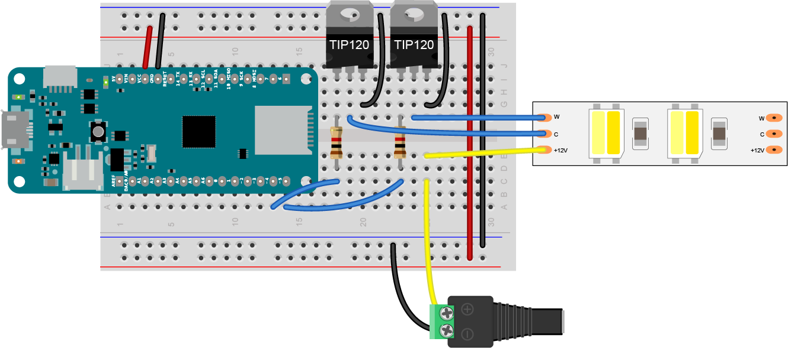

# Controlling LED Strips
LED strips are easy to come by these days, and often you get them without documentation, or you lose the label. In those cases, it's easy to be confused about what you've got. What follows is a guide to some of the more common types of LED strips, and circuits for controlling the non-addressable types from a microcontroller. There are many other good guides to LED strips out there, like Superbrightleds' [Ultimate LED Strip Lighting Guide](https://www.superbrightleds.com/blog/ultimate-led-strip-lighting-guide/5024/).

These notes don't cover [addressable LED strips](addressable-leds.md), as those strips require a different approach to control. 

## Electrical and Physical Characteristics
There are a number of characteristics to consider when shopping for LED strips:

**Channels** - how many color channels does the strip have? Most strips feature some combination of red, green, blue, white, cool white, warm white, or amber LEDs.  

**Voltage** - The most common voltages are +5V, +12V, and +24V. Even if you're using a 5V microcontroller like the Arduino Uno, you'll need a separate power source and a transistor to control each channel, because the current of each channel will be greater than the microcontroller's GPIO pins can supply.

All LED strips have a maximum length you can use before there's a voltage drop significant enough to stop them from functioning. If you need a run of LEDs that's longer than the maximum for your strip type allows, you'll need to wire an additional power supply in the line. This adds control complications, of course. When you're considering a long run, you might want to use +24V LED strips, as they can generally handle a longer run without a significant drop. [Superbrightleds'  guide](https://www.superbrightleds.com/blog/ultimate-led-strip-lighting-guide/5024/) has some good tips on managing power supplies and using amplifiers.

**Current** - The current on a given LED strip will vary based on the number of LEDs on the strip, and should be listed on the site you purchase it from, but a good rule of thumb is to calculate 20 mA per channel per LED. So an RGB LED strip might consume as much as 60 mA per LED when you turn on all three channels. You should leave some overhead in choosing a power supply; 20% is a good number. For example, if your strips need 4 amps, then pick at least a 5 amp supply. 

**Package** - Strip LEDs generally come in one of two packages (physical forms): 5050 and 3528. 5050 LEDs are square, 5mm to a side. 3528 LEDs are 3.5mm x 2.8mm. 5050 LEDs usually draw more current than 3528's and are brighter as well. 

**Color Temperature** - Color temperature, measured in degrees Kelvin (°K), refers to the warmth or coolness of a light source. the higher the Kelvin temperature, the cooler the color hue. Here are the typical terms and their ranges indegrees Kelvin

* warm white: ~3000K
* cool white: ~5400K
* natural white: ~4000K
* amber: ~1800-2000K
* daylight: ~6500K and above

**Density** - The number of LEDs per unit length will vary. 60 LEDs per meter and 144 LEDs per meter are common with LEDs in a 5050 package (the *package* of a component refers to its physical shape and size). The density of LEDs affects both the brightness and evenness of the light and the total current draw of the strip. 

**Lumen output** - the brightness of any light source can be measured in *lumens*. For a good description of the main physical terms used to quantify lighting, see [this video from Philips](https://www.youtube.com/watch?v=9nPIzyV1mW0). For more on this, see  Kitsinelis, Spiros, _Light Sources, Second Edition: Basics of Lighting Technologies and Applications_ or Descottes, Hervé; Ramos, Cecilia E. (2013-07-02), _Architectural Lighting: Designing With Light And Space (Architecture Briefs)_ or my [lighting terminology page](https://itp.nyu.edu/classes/light/lighting-terminology/).  Here's an example of how to work with this information:

Illuminance, the density of light energy on a surface, decreases with the square of the distance from the source. Illuminance levels are usually given in lux, which is lumens/meters^2. So if you have [a source that's 1148 lumens/m](https://www.superbrightleds.com/moreinfo/flexible-led-strip-lights/3528-tunable-white-led-strip-lighttape-light-24v-ip20-350-lumensft/5497/12019/#tab/specifications), and you expect it to light a wall that's 2 meters away from the source, then the illuminance on the wall would be 287 lux. That's not bad for incidental use. Here are some suggested illuminance levels (from Descottes, Hervé; Ramos, Cecilia E. (2013-07-02). _Architectural Lighting: Designing With Light And Space (Architecture Briefs)_):

* Incidental use: 200 lx
* General work/office use: 300 lx
* Task lighting: 5-700 lx
* Specialized work: 1000-1500 lx
* Midday sun: 32K – 100K lx

**Control lines** Most LED strips are common anode strips, meaning that there's one shared line for voltage input, and separate lines for control of each channel. If you think of each channel as a single LED, the channel's endpoint is the cathode for that LED.

Figure 1 below, taken from [Environmental Lights' datasheet](https://www.environmentallights.com/files/documents/rgb-5in1-5050-60-reference-sheet.pdf), shows the control lines for a  5-channel LED strip. This strip has a common +24V DC connection at the top of the strip's end, and below it, connections for warm white (2700K), green, red, blue, and cool white (6500K). Each of the color control lines is the common anode for all the LEDs of that color in the strip.

_Figure 1. 5-channel 24-volt LED strip. From [Environmental Lights' datasheet](https://www.environmentallights.com/files/documents/rgb-5in1-5050-60-reference-sheet.pdf)._ 

## Transistors to Control LED Sources 

You can control 12-24V DC sources with power transistors or MOSFETs from a microcontroller quite easily. The three models below work well for this purpose. 

Although the circuits below show how to control a 12V LED strip, the same circuit could be used to control any 12-24V DC LED source.

The control method here isn't affected by whether your power supply is capable of [dimming](https://www.superbrightleds.com/cat/dimmable-led-power-supplies/) or not, because you'll be doing the dimming yourself from a microcontroller.

### TIP120 Darlington transistor
 These have been a staple in my projects for over two decades. [The TIP120](https://octopart.com/search?q=TIP120) transistor [(datasheet)](https://www.mccsemi.com/pdf/Products/TIP120(TO-220).pdf) is a bipolar transistor, designed for high current inductive loads like motors. Darlington transistors are actually two transistors in one, where the pairing of the two results in higher gain. The TIP120 has a built-in snubber diode to prevent damage from back-voltage generated by motors. You don't actually need these things for controlling LEDs, but what makes the TIP120 useful is that it can control a load up to 60V and 5A and it can be controlled reliably by either a 5V or 3.3V output from a microcontroller. 

 Figure 2 shows the wiring for a TIP120 Darlington transistor controlling a 12V DC LED source. The same circuit can be used for a 24V source, with a different power supply. 

_Figure 2. TIP120 transistor controlling an LED source._ 

If you're holding the TIP120 with the tab at the top and the bulk of the component facing you, then the pins, from left to right, are: base, collector, emitter. The base should be connected to a 1 kilohm resistor, and the other side of the resistor should be connected to the GPIO pin of the microcontroller that you plan to use to control the LEDs. The collector should be connected to the cathode of the LED source, and the emitter pin should be connected to ground. 

In Figure 2, the MKR Zero microcontroller is mounted as usual, straddling the center of a breadboard with its top pins plugged into row 1 of the board. The Vcc pin (physical pin 26) is connected to the breadboard's voltage bus as usual, and the ground pin (physical pin 25) is connected to the ground bus. The voltage and ground buses on either side of the board are connected to each other. Two TIP120 transistors are mounted in the right center section of the board below the MKR Zero, in rows 18-20 and 23-25, respectively. The MKR Zero's pins D4 and D5 (physical pins 13 and 14) are connected to 1 kilohm resistors, and the other ends of the resistors are connected to the bases of the transistors, in rows 18 and 23, resepective transistors' emitter pins, in rows 20 and 25, are both connected to ground. The transistors' collector pins are connected to the C and W connections of a 12V LED strip. The positive terminal of a DC power jack is connected to the +12V connection on the strip. The power jack's negative terminal is connected to the breadboard's ground bus. The jack should be connected to a +12V DC power supply. 

### FQP30N06L N-Channel MOSFET
A MOSFET (Metal Oxide Semiconductor Field-Effect Transistor) is a slightly more modern transistor, designed specifically for switching applications. Bipolar transistors draw a certain amount of current at the base to switch, while MOSFETs draw almost no current on their gate.  They're ideal for switching LED sources. They are more sensitive to electrostatic discharge than bipolar transistors, though, so you have to be more careful not to accidentally expose them to a static shock. Make sure you've grounded yourself well before working with MOSFETs. 

The [FQP30N06L](https://octopart.com/search?q=FQP30N06L) MOSFET [(datasheet)](https://cdn.sparkfun.com/datasheets/Components/General/FQP30N06L.pdf) is an N-channel MOSFET designed for switching high-speed circuits, and it's perfect for switching LEDs. It can control up to a 60V, 30A load and can be switched from 3.3V or 5V.

_Figure 3. MKR Zero connected to a FQP30N06L MOSFET for controlling an LED source, in this case a strip of 12V warm white/cool white LEDs._ 

 Figure 3 shows the wiring for a MOSFET transistor controlling a 12V DC LED source. The same circuit can be used for a 24V source, with a different power supply. The wiring is similar to the TIP120 wiring, but the 1 kilohm resistors are omitted.

If you're holding the FQP30N06L MOSFET with the tab at the top and the bulk of the component facing you, then the pins, from left to right, are: gate, drain, source. The gate should be connected to the GPIO pin of the microcontroller that you plan to use to control the LEDs. The drain should be connected to the cathode of the LED source, and the source pin should be connected to ground. 

In Figure 3, the MKR Zero microcontroller is mounted as usual, straddling the center of a breadboard with its top pins plugged into row 1 of the board. The Vcc pin (physical pin 26) is connected to the breadboard's voltage bus as usual, and the ground pin (physical pin 25) is connected to the ground bus. The voltage and ground buses on either side of the board are connected to each other. Two FQP30N06L MOSFETs are mounted in the right center section of the board below the MKR Zero, in rows 18-20 and 23-25, respectively. The MKR Zero's pins D4 and D5 (physical pins 13 and 14) are connected to the gates of the MOSFETs, in rows 18 and 23, resepectively. THe MOSFETs' source pins, in rows 20 and 25, are both connected to ground. The MOSFETs' drain pins are connected to the C and W connections of a 12V LED strip. The positive terminal of a DC power jack is connected to the +12V connection on the strip. The power jack's negative terminal is connected to the breadboard's ground bus. The jack should be connected to a +12V DC power supply. 

### IRLB8721 N-Channel MOSFET

The [IRLB8721](https://octopart.com/search?q=IRLB8721) MOSFET [(datasheet)](https://www.infineon.com/dgdl/irlb8721pbf.pdf?fileId=5546d462533600a40153566056732591) is similar in specs to the FQP30N06L. It too can control up to a 60V, 30A load and can be switched from 3.3V or 5V. The pin configuration for this MOSFET is identical to the FQP30N06L, so Figure 3 above will work with this part in place of the previous MOSFET with no other change. 

## Controlling Multi-Channel LED Strips

Other than single-color LED strips or warm/cool strips, you may want to control RGB or RGBW or RGBAW (red, green, blue, amber, white), or some other variation. As long as the strip is not made of addressable LEDs, you can use variations on these same circuits. For example, if you've got a strip that's RGBW, you'd need four transistors, one for each channel. 

