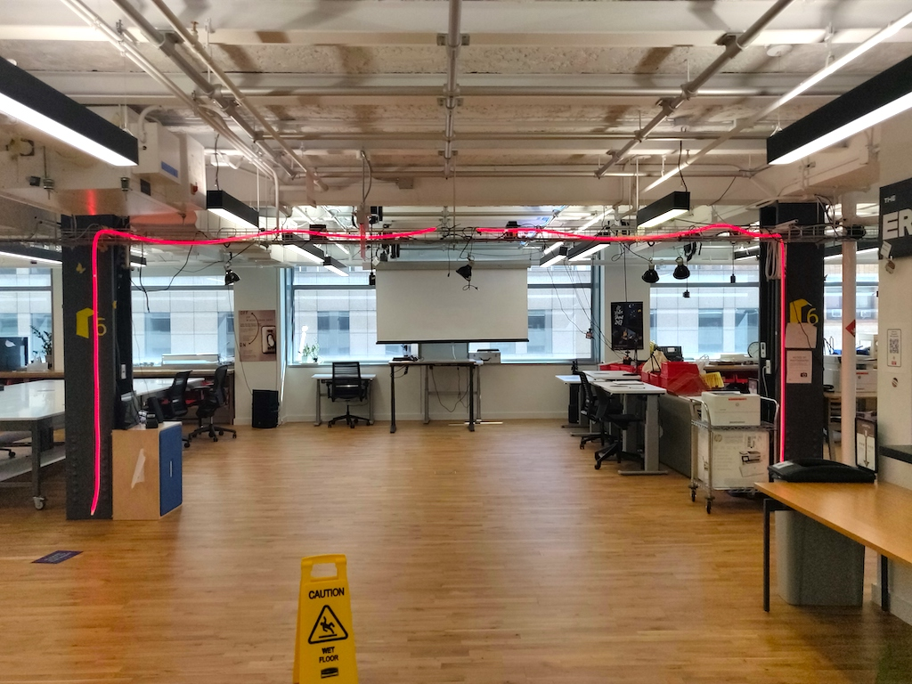
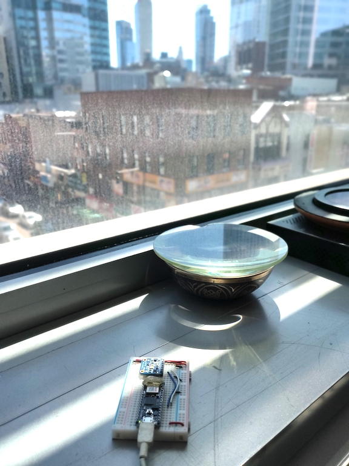
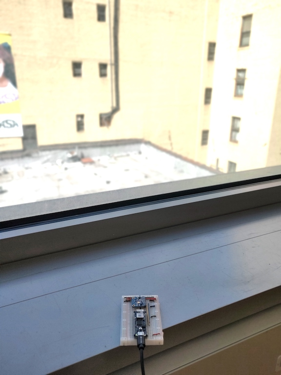
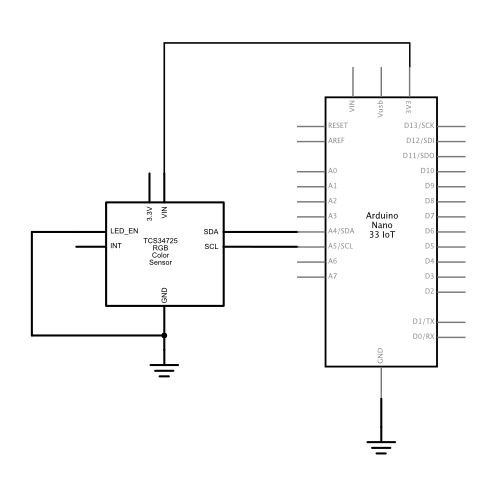

# Sky Lights

For a long time I've wanted to make indoor lights change with the light from the sky outside. Today, I had a free hour, so I built a test of it. 

I started with a Philips Hue system we have installed at ITP, and a couple of Arduino Nano 33 IoT modules. Nun and Name installed a few of the Hue lightstrips as an arch to welcome people to the floor, as shown in Figure 1. I decided that if I could get the arch to reflect the color temperature from the eastern and western sides of the building, that would be a decent test. 

_Figure 1. Archway of light in the entrance of ITP's 370 Jay St space._ 

I have a few TCS34725 light sensor boards from Adafruit, which I attached to two Nano 33 IoT boards to use as my networked light sensors. Figure 2 shows one on the southeast corner of the floor, late morning, and Figure 3 shows the one on the southwest corner of the floor, same time.

_Figure 2. Nano 33 IoT and light sensor in a southeast window. In the morning, this sensor will be hit with direct sunlight, but for most of the day, it will be in indirect sunlight._ 

_Figure 3. Nano 33 IoT and light sensor in a southwest window. In the afternoon, this sensor will be hit with direct sunlight, but for most of the day, it will be in indirect sunlight. The reflection off the pale yellow wall next door will probably lower the color temperature a little._ 

## The Circuit

The circuit is fairly simple. The sensors draw their power from the Arduino's voltage, and the I2C pins of the sensor are connected to the I2C pins of the Arduino. The sensor's LED pin is wired to ground, because there is a built-in LED which will turn on otherwise.  Figure 4 shows the breadboard layout, and Figure 5 shows the schematic. 

_Figure 4. Nano 33 IoT and light sensor, breadboard view._ 

_Figure 4. Nano 33 IoT and light sensor, breadboard view._ 

## The Code

I started my code using the [HueBlink example](https://github.com/arduino-libraries/ArduinoHttpClient/blob/master/examples/HueBlink/HueBlink.ino) from the [ArduinoHTTPClient](https://github.com/arduino-libraries/ArduinoHttpClient) library. I also referred to the Philips' documentation of the [Hue API](https://developers.meethue.com/). Knowing from the Hue documentation that the API uses JSON, I incorporated the [Arduino_JSON](https://github.com/arduino-libraries/Arduino_JSON) library to simplify the data formatting. I also used [Adafruit's TCS34725 library](https://github.com/adafruit/Adafruit_TCS34725) for the sensor.

The pseudocode for my program is as follows:

setup:
* Initialize the sensor
* Make the WiFi connection

Loop:
* If a minute has passed, and you're not in the middle of a request, 
   * Read the sensor
   * Make a HTTP Request to the Hue hub
* If you are in the middle of a request, wait for a reply
   * Print the reply

Sensor reading:
* Get the raw values
* Convert to illuminance (lux) and color temperature (degrees Kelvin)
* Convert illuminance to a 0-254 range for the Hue
* Convert color temperature to the [Mired scale](https://en.wikipedia.org/wiki/Mired) for the Hue

That's basically it. The full sketch can be found [here](https://github.com/tigoe/LightProjects/tree/master/HueSkyLight). The biggest challenge was the compression of the light levels (brightness or illuminance), because the illuminance levels can go from below 20 in a dim space to over 35000 lux in full sunlight. The Hue has a 0-254 range for brightness. I derived my range by experimetation. I found that it went to about 2000 lux in indirect sunlight, so I constrained my result to 2000 points, mapped it to a 0-254 range to get a reading the Hue could accept. It's crude, but we'll see how it does over time. 