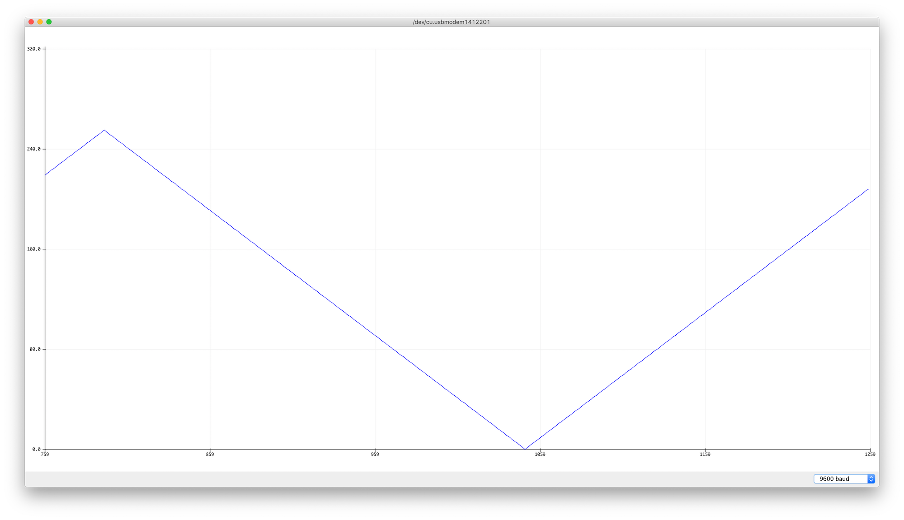
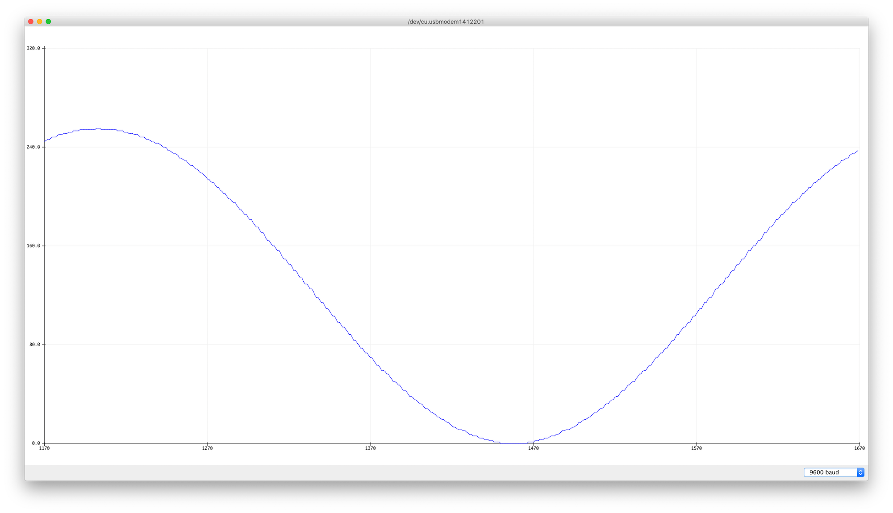
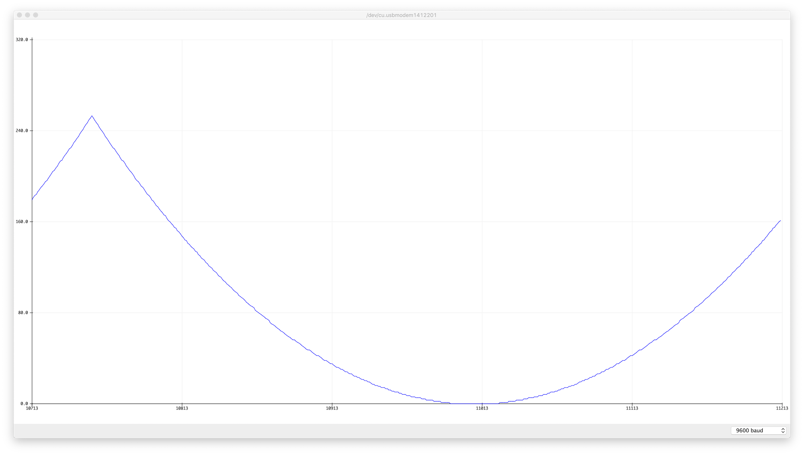
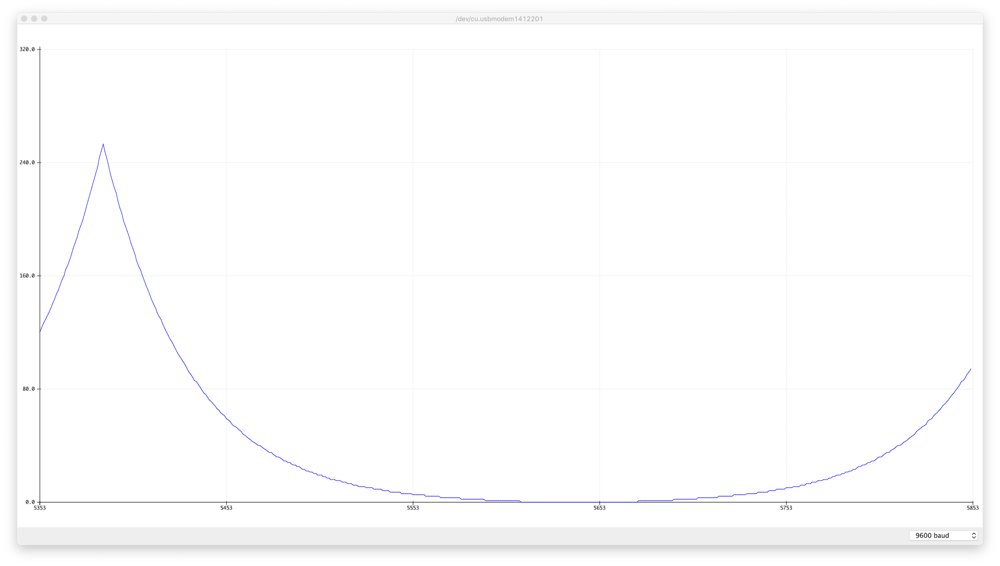
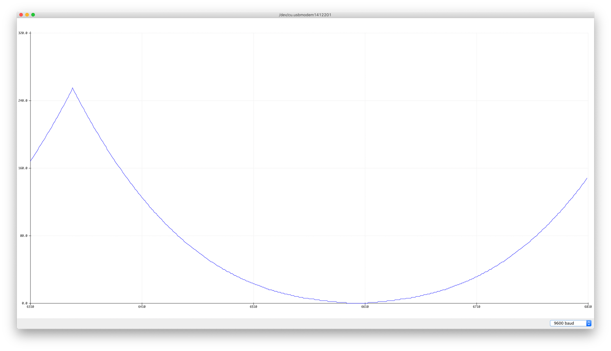

# Fading Light

Light doesn't change in a linear fashion, and the human eye doesn't respond to light in a linear fashion. Light, like all forms of radiant energy, decreases with the square of the distance from the source. Furthermore, the human eye responds to light in a logarithmic fashion. In 1931, the International Commission on Illumination (CIE) released a study of *psychometric colorimetry*, or the measurement of how we perceived changes in light. The landmark study resulted in the [CIE 1931 standard colorimetric system](http://www.cie.co.at/eilv/150), a standardized way of describing perceived color. As part of that, they defined a [formula for lightness](http://www.photonstophotos.net/GeneralTopics/Exposure/Psychometric_Lightness_and_Gamma.htm) as we perceive it. In the CIE 1931 formula, lightness varies linearly from 0 to 8 percent, and on a  1/3 power function from 8 percent to 100 percent. 

Add to this the fact that different diffusers and reflectors affect the perceived perceived lightness of a source, and you'll see that lightness is a complex matter. As a result, it's helpful to have a few non-linear formulas for fading light when you're controlling light from a computer. Depending on the effect you're looking for, you might want a light source to start fading slowly and then speed up, or slow down at the end of its fade. 

## Fade Curve Examples
The fade curve section of  this repository contains examples of a number of different fade curves:
* Simple linear fade
* output = sine of input curve
* output = input squared curve
* output = exponential formula of input curve
* output = CIE1931 lightness calculation of input

Each of these curves has a different effect, described below. The graphs below show you the fade curves for each example as well. 




_Figure 1. Graph of simple linear fade_ 

Figure 1 shows a graph of the the [simple linear fade](https://github.com/tigoe/LightProjects/tree/main/FadeCurves/SimpleFade). The peak and the trough are sharp changes, and since the power output doesn't match the lightness output, the light seems steady for most of the time, with very quick fades up and down at the ends of the fade.



_Figure 2. Graph of sine fade curve._ 

Figure 2 shows a graph of a [sine fade curve](https://github.com/tigoe/LightProjects/tree/main/FadeCurves/SineFade). The slope of the curve flattens out at the top and bottom, so the change seems slightly more smooth.



_Figure 3. Graph of x squared fade curve._ 

Figure 3 shows a graph of the [xSquared fade curve](https://github.com/tigoe/LightProjects/tree/main/FadeCurves/XSquaredFade). The fade feels reasonably even here, particularly at the bottom, but the peak is sharp, so the change from going up to going down feels a little fast.



_Figure 4. Graph of an exponential fade curve._ 

Figure 4 shows a graph of an [exponential fade curve](https://github.com/tigoe/LightProjects/tree/main/FadeCurves/ExponentialFade) derived by [Diarmuid Mac Namara](https://diarmuid.ie/blog/pwm-exponential-led-fading-on-arduino-or-other-platforms). Mac Namara attempted to correct for the logarithmic change in perceived brightness by trial and error, and came up with the following formula:
````
x = x^(2/r) - 1
````
* x is the step of the fade, with a resolution of 0-255; 
* y is the PWM value, also 0-255;
* r is a factor that is calculated based on the number of steps and the required output. 2m/r=p Where p is the maximum value of the PWM cycle and m is the number of steps of the LED fade. If you're taking 256 steps and your PWM range is 0-255, then r = 2, and the formula becomes 
````
x = x^2 - 1
````
That's pretty close to the x squared curve above, but when you compare Figures 2 and 3, you see that Mac Namara's curve is a bit steeper, and the tail at the fading end is longer. It feels like it takes longer to get bright, and it drops off a bit faster. 



_Figure 5. Graph of the CIE1931 fade curve._ 

Figure 5 shows a graph of the [CIE1931 fade curve](https://github.com/tigoe/LightProjects/tree/main/FadeCurves/CIE1931Fade) derived from the [CIE1931 lightness formula](http://www.photonstophotos.net/GeneralTopics/Exposure/Psychometric_Lightness_and_Gamma.htm). It looks pretty close to the x squared curve, but it's a little different in the last 8 percent, where it's linear. This is probably not visible in this graph, but it's noticeable when you run the fade.

## Pre-calculating the Fade Curve 
In the examples above, you'll see that the values for the fade curves are calculated in the `setup()` function and placed in an array. In the `loop()`, the sketch gets an input from 0 to 255 and then looks up the corresponding value in the array. Calculating complex math formulas like sine, or raising a value to an exponent, takes longer than looking up an array element, so if the formula's not going to change, it makes sense to pre-calculate your fade curve. If you want to use formulas other than the ones shown here, a generic sketch might look something like this:

````
byte levelTable[256];    // pre-calculated PWM levels
int change = 1;          // resolution of one fade step
int fadeIncrement = 10;  // time of one fade step, in ms

void setup() {
  // pre-calculate the PWM levels from the formula:
  fillLevelTable();
}

void loop() {
  // change the current level:
  currentLevel += change;

  //PWM output the result:
  analogWrite(5, levelTable[currentLevel]);
  // delay by the fadeIncrement:
  delay(fadeIncrement);
}

void fillLevelTable() {
  // set the range of values:
  float maxValue = 255;

  // iterate over the array and calculate the right value for it:
  for (int l = 0; l <= maxValue; l++) {
    // calculate the light level here:
    byte lightLevel = (some formula);
    levelTable[l] = lightLevel;
  }
}
````
Changing the formula will change the fade curve, of course, and changing the fade increment will change the total time of the fade.

## Fade Curves with Interactive Input

You don't always want your fades to be automated. The most common human input control for fading light is a dimmer switch or rotary knob, usually a potentiometer. To use these fade curves with an external input, all you have to do is to map the input to the range of your fade curve steps (0-255 in all the examples here, because that's the PWM resolution of an Arduino), and look up the corresponding value in the level table.  Examples are included for the [simple fade with input](https://github.com/tigoe/LightProjects/tree/main/FadeCurves/SimpleFadeWithInput), the [sine fade with input](https://github.com/tigoe/LightProjects/tree/main/FadeCurves/SineFadeWithInput), and the [CIE1931 fade with input](https://github.com/tigoe/LightProjects/tree/main/FadeCurves/CIE1931FadeWithInput), but you can use these to derive your own as well.

## Effects of Input Controls

When you start writing fade curves and you notice unpleasant jumps in your fades or other outputs you don't expect, don't automatically assume your fade curve is to blame. Test with the non-interactive fades first, to make sure the curve is not the problem, then check your inputs. For example, is your potentiometer a [linear pot](https://www.digikey.com/product-detail/en/bourns-inc/3310C-102-103L/3310C-102-103L-ND/2534040) or an [audio taper (logarithmic) pot](https://www.digikey.com/product-detail/en/bourns-inc/51UAD-T16-D15L/51UAD-T16-D15L-ND/2564558)? Since pots are so commonly used to control audio and lighting, they are often designed to change their resistance on a logarithmic curve rather than a linear. That could affect your perception of the fade.

Also consider how noisy the output of your potentiometer is. [Write a simple example to test the output](https://www.arduino.cc/reference/en/language/functions/analog-io/analogread/) of the pot and see if the values change when you're not touching it. If so, check your wiring to make sure everything is stable. If the pot is still noisy, consider adding a [smoothing function](https://www.arduino.cc/en/Tutorial/Smoothing) or a Kalman filter to stabilize the pot's readings. The [CIE1931 Fade with Kalman Input example](https://github.com/tigoe/LightProjects/tree/main/FadeCurves/CIE1931FadeWithKalmanInput) shows how you can use  the [SimpleKalmanFilter library](https://github.com/denyssene/SimpleKalmanFilter) to smooth your potentiometer readings. 


## References
* Briggs, David. _[The Dimensions of Color](http://www.huevaluechroma.com/)_ [1.3 Lightness](http://www.huevaluechroma.com/013.php)
* International Commission on Illumination, [CIE 1931 standard colorimetric system [X, Y, Z]](http://www.cie.co.at/eilv/150)
* Madsen, Rune. _[Programming Design Systems](https://programmingdesignsystems.com)_, chapter 9, ["Perceptually Uniform Color Spaces"](https://programmingdesignsystems.com/color/perceptually-uniform-color-spaces/)
