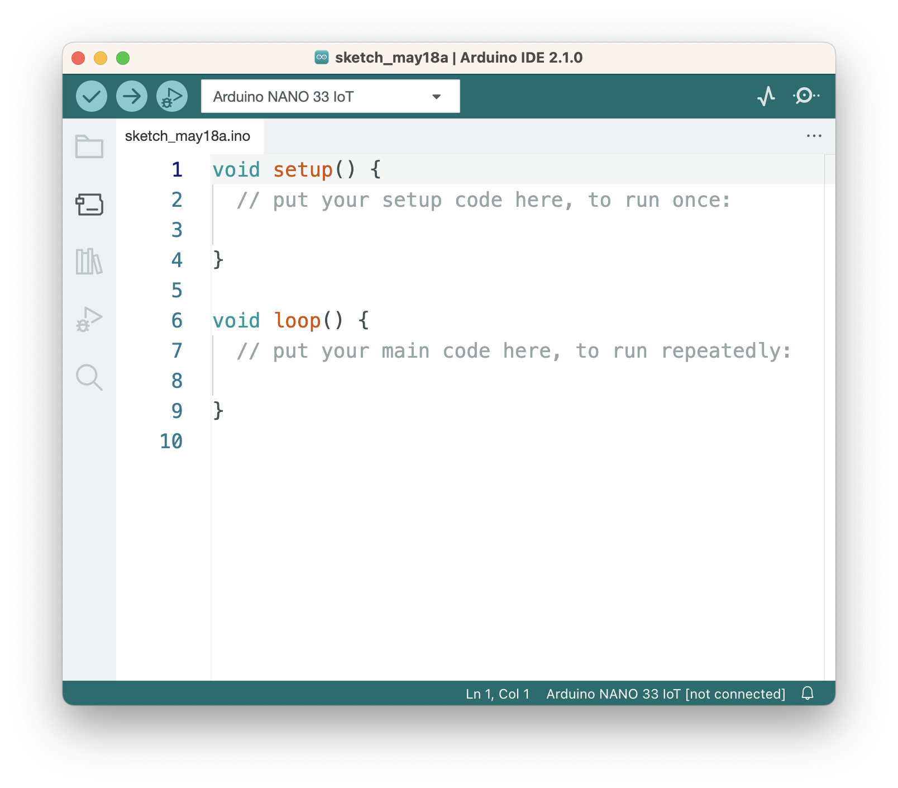
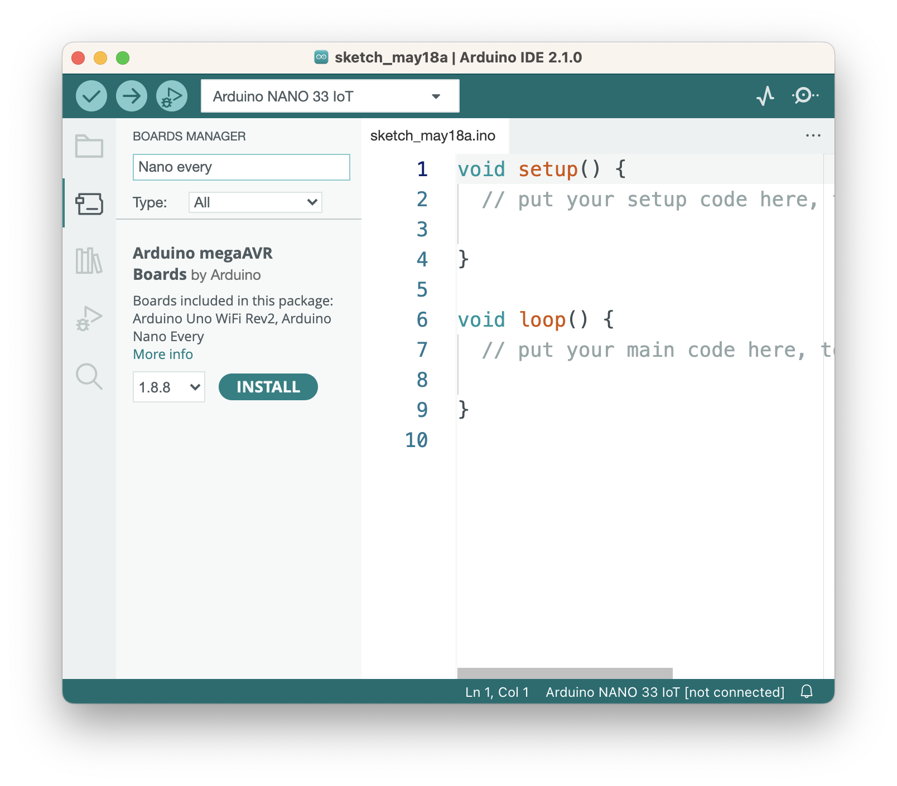
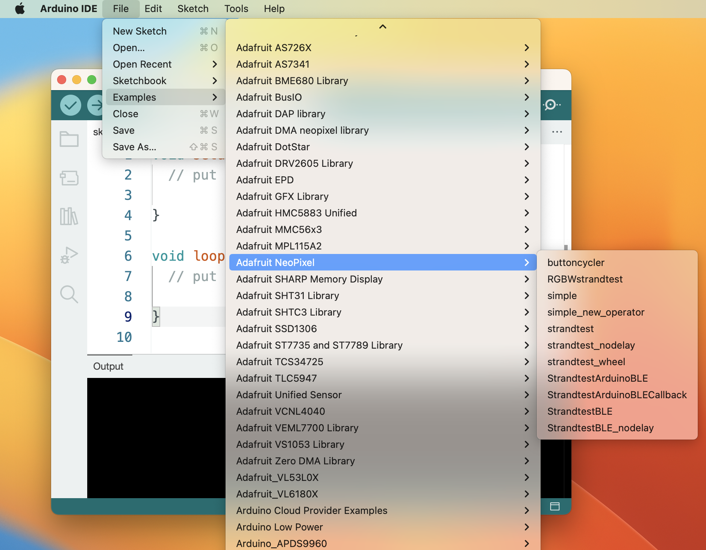

# Installing the Arduino IDE for Light Projects

Most of the projects in this repository use the Arduino Integrated Development Environment (IDE) and various models of Arduino. This page explains how to install the IDE and how to install board definitions and libraries. 

## Download the IDE

The Arduino IDE can be downloaded for MacOS, Windows, or Linux at [this link](https://www.arduino.cc/en/software). All of the code examples in this repository will work with version 2.1.0 or later. Download the installer package for your OS, unzip it, and run the installer. It will install the program in your Applications folder. 

## Open the IDE and Install Board Definitions

After the IDE is installed, open it and you'll get a new blank sketch. Figure 1 shows the IDE with a blank sketch.

 
_Figure 1. The Arduino IDE._

Click on the Boards Manager icon (the second icon on the left) to open the Boards Manager, then type in the name of your board to filter the list of boards, then click the Install button when you find your board type. Figure 2 below shows the board type for the Nano Every.

 
_Figure 2. The Arduino IDE with Boards Manager open._

## Install Libraries

To install any libraries needed, click the Libraries icon (third icon on the left) to open the Library Manager. The Library Manager works like the Boards manager: type in the library you want to filter the list. For the [Electronic Candles](candles.md) project in this repository, you'll need the Adafruit NeoPixel library, or Adafruit DMA NeoPixel library if you're using a Nano 33 IoT or other SAMD-based board.

When you install libraries, they usually come with examples. Click on the File menu, choose Examples, and navigate to your library and you'll see the relevant examples. Figure 3 shows the File menu open to the Adafruit NeoPixel examples. 

 
_Figure 3. The Arduino IDE with File menu open to the examples._

Once you've installed the IDE, your board definitions, and your libraries, you're ready to begin working.