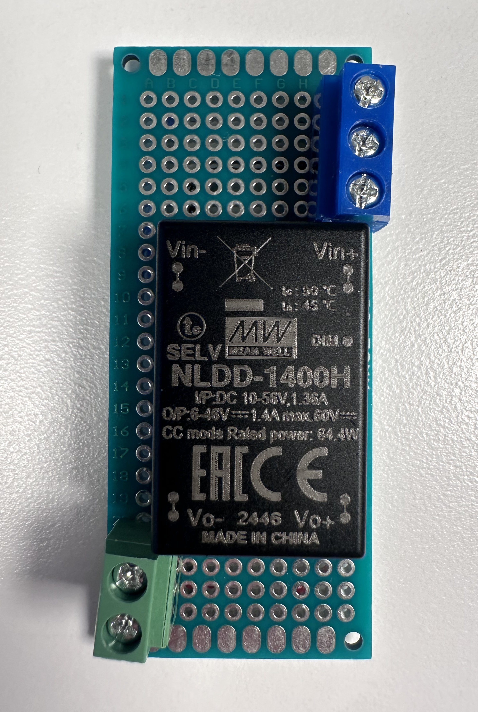
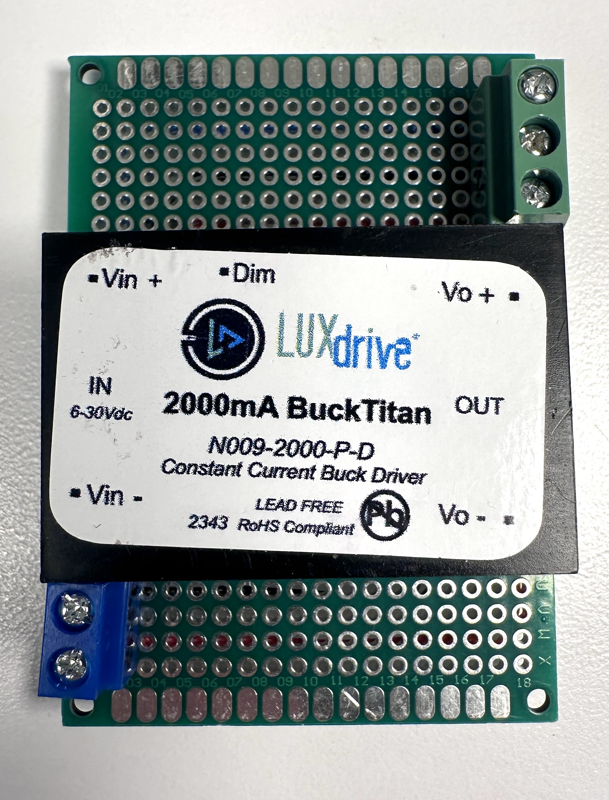
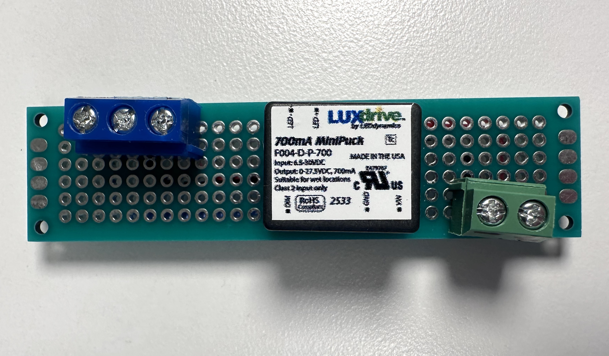
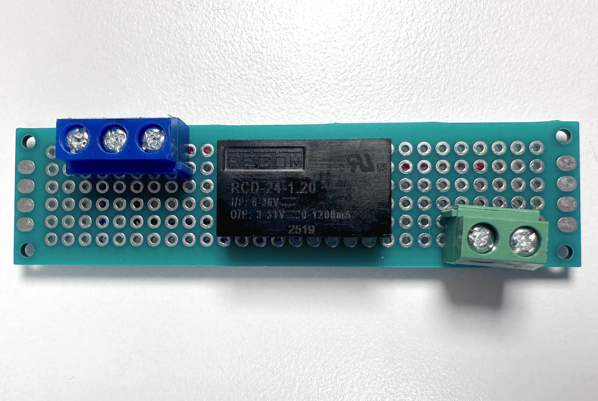

# LED Drivers

_by Christina Tang and Tom Igoe_ 

Light emitting diodes (LEDs) light up when you put a high enough voltage through them. This voltage is called the **forward voltage (Vf)**. Similarly, LEDs are rated by how much current they need to operate, and this is called the **forward current (If)**. If you supply too much voltage or too much current, you'll destroy the LED. But how much is too much?

An LED's data sheet will list the forward voltage and current, both the minimum amounts needed, the maximum (often listed as the **peak voltage** or **peak current**) and the recommended amounts for running the LED for a long time.  Within the limits of an LED's recomended current levels, more current will cause the LED to shine brighter. So many LED illumination systems will run LEDs at the highest current possible, to get the maximum illumination out of them.

As an LED operates, it will heat up, and as it heats up, the amount of voltage it uses will decrease, causing it to draw more current. Over time, as the LED gets more current, it will slowly burn out. Even if it doesn't burn out immediately, it will change color in the process. This is how you'll see some LED sources, particularly cheaper ones, die over time. This is known as [thermal runaway](). 

LED sources are generally operating multiple LEDs in parallel, and when you've got a lot of LEDs together, the heat can go up. But heat isn't the only issue. Voltage drops as it moves through a conductor, so if you've got a long line of wires connecting your LEDs, like in a linear fixture or tape light, the voltage might vary from one end to the other. 

## LED Drivers

In order to compensate for this, LED sources use [LED drivers](https://www.ledsupply.com/blog/understanding-led-drivers/) to manage the balance of current and voltage. A **constant voltage LED driver**, for example, will attempt to keep the voltage constant, while a **constant current driver** will attempt to keep the current constant. You'll see both kinds of drivers used in LED lighting systems, depending on the individual needs of the system. 

You'll also hear the terms **buck converter**, **boost converter**, or **buck-boost converter**. These are all [DC-to-DC converters](https://www.buckboostconverter.com/dc-buck-boost-converters-ranges-and-applications.html) that attempt to keep the voltage constant. These will adjust DC voltages so that you can use a slightly higher or lower voltage supply and yet still get a constant output. A buck converter will generally lower the voltage range, a boost converter will raise it, and a buck-boost converter will be capable of both. These are useful for adjusting, say, industrial supply voltage ranges to the ranges needed for digital control, such as microcontrollers. 

## Driver Control

Different LED Drivers feature a range of controls. In general, they are designed to integrate into a commercial lighting system, not necessarily to operate with microcontrollers. This means you'll see a range of control methods. 

Some are driven by simple **resistive dimmers**, which add resistance, lowering the signal voltage (not the supply voltage). 0-10VDC is an older, but still quite common, control method. It pre-dates digital controls, but can be driven by a simple potentiometer wall dimmer, if the voltage range is right. 

Some are driven by **pulse width modulation (PWM)** of a DC signal. This is perhaps the most common currently, as it can be controlled by a microcontroller, or by a simpler circuit like a digital timer like a 555 timer.  PWM systems operate at a range of voltages.  Many operate i the 1-10V DC range, meaning they can be driven by 3.3V or 5V DC microcontrollers, but it's important to check the exact range. 

Some are driven by AC dimming, using a **triac**, or **thyristor**. Triacs are digital switching components which operate like transistors, except that they can switch AC circuits, unlike transistors. For more on triacs and AC dimmers, see [this link](https://electrouniversity.com/what-is-a-triac-dimmer/) from [Electro University](https://electrouniversity.com/), a home electrical repair site. 

Some of the more recent higher-end ones are controlled by **digital control signals** like [DALI](https://www.dali-alliance.org/), which is the most recent industry-wide digital control system. 

LED drivers come in a variety of physical packages, but those for use in a printed circuit board circuit generally come with either pins or wires. Though they can be mounted on a solderless breadboard, it's sometimes useful to mount them on a separate PCB, with screw terminals or other easy-to-connect yet solid connectors. 

Here are the stats on four example PWM-controlled drivers, for comparison. The testing notes on each were done with an Arduino microcontroller PWMing the driver at 3.3V:

### Meanwell NLDD-H Series DC-DC Constant Current LED Driver

_Figure 1. Meanwell NLDD-1400H driver mounted to a PCB board_
* Input Voltage Range (V): 10-56
* Max Output Voltage (V): 46 (min 6)
* PWM Control Voltage (V): 2.5-5
* PWM Freq (Hz): 100 ~ 1000
* Output Current (mA): 1200 - 1400
* Max Watts @ 24VDC (W): 33.6
* Boost / Buck: Buck
* Connection Type: Pins, wires
* Size: 1.26" x 0.8" x 0.49" 
* Testing Notes (3.3V control): Probably ideal for most class applications

### BuckTitan DC High-Output LED Driver

_Figure 2. BuckTitan  LED Driver mounted to a PCB board_

* Input Voltage Range (V): 6-30
* Max Output Voltage (V): 28
* PWM Control Voltage (V): 5
* PWM Freq (Hz): Max 2000
* Output Current (mA): 1500 - 3000
* Max Watts @ 24VDC (W): 72
* Boost / Buck: Buck
* Connection Type: Pins, wires
* Size: 1.75" x 1.13" x 0.38"

###  MiniPuck DC PWM Dimmable Constant Current LED Driver

_Figure 3. MiniPuck LED Driver mounted to a PCB board_
* Input Voltage Range (V): 6.5-30
* Max Output Voltage (V): 30 - 2.5
* PWM Control Voltage (V): 1-30
* PWM Freq (Hz): 100 ~ 2000
* Output Current (mA): 350 - 700
* Max Watts @ 24VDC (W): 16.8
* Boost / Buck: Buck
* Connection Type: Pins
* Size: 0.79" x 0.66" x 0.43"
* Notes: Extra small form factor
* Testing Notes (3.3V control): Very easy to use with breadboards due to long pins. Extremely quiet, but lights 'ghost' on at 0

### Recom RCD Series LED Drivers RCD-24 Series 1.20

_Figure 3. Recom RCD series 1.20 LED Driver mounted to a PCB board_
* Input Voltage Range (V): 6-36
* Max Output Voltage (V): 31
* PWM Control Voltage (V): 2.2-15
* PWM Freq (Hz): 200 ~ 1000
* Output Current (mA): 1000 - 1200
* Max Watts @ 24VDC (W): 28.8
* Boost / Buck: Buck
* Connection Type: Pins, wires
* Size: 0.86" x 0.5" x 0.33"
* Notes: Not all of the pin/wire versions have PWM; double check. 
* Testing Notes (3.3V control): tends to 'pop' at the very top end of dimming. Compared to other models, buzzes audibly

There are many other drivers on the market, of course. The companies represnted here, [Meanwell](https://www.meanwellusa.com/), [LED Dynamics](https://leddynamics.com/)' LuxDrive line, and [Recom](https://recom-power.com/), are just three of a wide market. Most electronics companies will carry drivers. These were sourced from [LEDSupply](https://www.ledsupply.com/), which has excellent [driver notes](https://www.ledsupply.com/blog/category/drivers/) and [Lighting 101 notes](https://www.ledsupply.com/blog/category/led-lighting-101/) as well; Digikey, which has a [wide inventory of LED drivers](https://www.digikey.com/en/products/filter/led-drivers/924). Many other lighting supply companies, such as [Bulbs.com](https://www.bulbs.com/), [1000Bulbs.com](https://www.1000bulbs.com/), and others have drivers as well. 

For more on simple low-voltage DC control, see [this page](/led-lamps.md) on controlling DC lamps. The first three examples show how to use a transistor to control a DC lamp (a [TIP120 Darlington transistor](/led-lamps.md#tip120-darlington-transistor), [FQP30N06L MOSFET](/led-lamps.md#fqp30n06l-n-channel-mosfet), and [ILRB8721 MOSFET](/led-lamps.md#irlb8721-n-channel-mosfet), respectively), and the [fourth example](/led-lamps.md#nldd1400h-led-driver) shows how to use the Meanwell driver mentioned above. 

## References:

* [Light-Emitting Diodes (LEDs)](https://learn.sparkfun.com/tutorials/light-emitting-diodes-leds), Sparkfun tutorials site. Contributors:  Nick Poole,  bboyho
* [Voltage, Current, Resistance, and Ohm's Law]((https://learn.sparkfun.com/tutorials/voltage-current-resistance-and-ohms-law)), Sparkfun tutorials site. Contributors:  CTaylor

* [Understanding LED Drivers and How To Choose the Right One](https://www.ledsupply.com/blog/understanding-led-drivers/) LEDSupply blog, Taylor Scully, 2020

* [What Type of LED Driver Do I Need? Constant Current vs. Constant Voltage](https://www.ledsupply.com/blog/constant-current-led-drivers-vs-constant-voltage-led-drivers/). LEDSupply blog, Taylor Scully, 2019