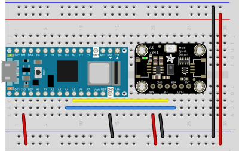

# Building Your Own Spectrometer

It's common in any lighting practice to need a spectrometer to measure the properties of light. Good spectrometers are expensive, though. Fortunately, there are some affordable spectral sensors that you can connect to a microcontroller to make your own spectrometer. This tutorial shows you how to connect the AMS [AS7341 11-channel spectral sensor](https://ams.com/as7341#tab/documents) to an [Arduino Nano 33 IoT](https://store-usa.arduino.cc/products/arduino-nano-33-iot). The AS7341 will work with any microcontroller that has an I2C interface, but the Nano 33 IoT has a Bluetooth and WiFi radio, making it easy to connect to via multiple means.

Below, you'll see how to get output from your spectrometer via multiple means: 
* UART serial to [p5.js](https://p5js.org)
* WiFi and MQTT to an MQTT broker, with a p5.js client

## The AS7341 Sensor

The AS7341 is an 11-channel spectral sensor that can detect light levels in multiple frequencies from around 400nm to 900nm. It has 8 that sense light in visible spectrum; one channel in the near infrared spectrum; one clear channel without a filter; and one channel that detects 50Hz-60Hz light flicker. 

Here is the [product page](https://ams.com/as7341) and the [datasheet](https://ams.com/documents/20143/36005/AS7341_DS000504_3-00.pdf/5eca1f59-46e2-6fc5-daf5-d71ad90c9b2b).

The frequencies it can detect are as follows:
* F1: 415nm (violet)
* F2: 445nm (blue)
* F3: 480nm (light blue)
* F4: 515nm (green)
* F5: 555nm (yellow green)
* F6: 590nm (yellow)
* F7: 630nm (orange)
* F8: 680nm (red)
* NIR: 910nm (near IR)
* Clear: non filtered
* FD: (Flicker Detection) non filtered

The following companies make breakout boards for it: 
* [Sparkfun](https://www.sparkfun.com/products/17719)
* [Adafruit](https://www.adafruit.com/product/4698)
* [DFRobot](https://www.dfrobot.com/product-2132.html)

The following companies make Arduino libraries for it:
* [Adafruit](https://github.com/adafruit/Adafruit_AS7341)
* [Sparkfun](https://github.com/sparkfun/SparkFun_AS7341X_Arduino_Library)

## The Circuit

The circuit for all of the applications below is the same. These diagrams show [Adafruit's AS7341 breakout boards](https://www.adafruit.com/product/4698), but any breakout board for the AS7341 will work. The AS7341 connects to the Nano 33 IoT via I2C. For the Arduino Uno or Nano boards, the I2C pins are pins A4 (SDA) and A5 (SCL). The sensor's SDA pin connects to the Arduino's SDA pin and the SCL pin connects to the Arduino's SCL pin. The sensor's voltage and ground pins connect to the microcontroller's power and ground pins as well. This is the same connection for almost any I2C sensor. Figures 1 and 2 below shows the connections. 

_Figure 1. Breadboard view of an AMS AS7341 sensor connected to a Nano 33 IoT. The Nano's SDA pin (physical pin 8) is connected to the sensor's SDA pin (physical pin 4) and the Nano's SCL pin (physical pin 9) is connected to the sensor's SCL (physical pin 3). The sensor's Vdd (physical pin 1) is connected to the Nano's 3V3 pin (physical pin 2) and the sensor's ground (physical pin 2) is connected to the Nano's ground (physical pin 14). Image created using [Fritzing](https://fritzing.org)._

_Figure 1. Schematic view of an AMS AS7341 sensor connected to a Nano 33 IoT. The connections are as described above: SDA to SDA, SCL to SCL, voltage and ground to voltage and ground, respectively. Image created using [Fritzing](https://fritzing.org)._

## Serial to p5.js Client

The simplest way to see the readings from the AS7341 is by printing the values out from the Nano's serial port (UART). This example does just that. It prints the sensor readings, converts them to basic counts, applies a daylight correction, and sends the values out to the serial monitor. For an explanation of the process, see the [Spectral Sensor
Calibration Methods](https://ams.com/documents/20143/36005/AS7341_AN000633_1-00.pdf/fc552673-9800-8d60-372d-fc67cf075740)  application note, section 2.1 - 2.5. 

__TO DO:__ The correction math in these examples is crude, and simply applies the numbers in Fig. 10 of the application note with no further math. I haven't yet verified its accuracy. 

There is a browser-based client to read and visualize the data from serial port in this repository as well. It uses [p5.js](https://p5js.org), [chart.js](https://www.chartjs.org/) and the [p5.serialport library](https://github.com/p5-serial/p5.serialport) and [p5SerialControl](https://github.com/p5-serial/p5.serialcontrol/tags) app. 

* [raw code](https://github.com/tigoe/LightProjects/tree/main/spectrometers/AS7341)
* [p5.js application in gitHub pages](https://tigoe.github.io/LightProjects/spectrometers/AS7341/spectrograph_chartjs_serial/index.html)

## WiFi and MQTT Client

If you've never connected to WiFi using the Nano 33 IoT, you should visit the [WiFiNINA reference](https://www.arduino.cc/en/Reference/WiFiNINA) and [this repository](https://tigoe.github.io/Wifi101_examples/). 

The Message Queueing Telemetry Transfer (MQTT) protocol was made for sensor monitoring over IP networks, so it's a good choice for a WiFi-based system for the spectrometer. MQTT is a __publish-and-subscribe__ or __PubSub__ model, in which clients connect to a broker application and subscribe to different topics. When they have new data, they publish to the topics. Topics can be broken up into subtopics when useful as well. There is very little overhead to the protocol; you just subscribe, then either publish or wait for messages. For more on MQTT, see [this repository](https://tigoe.github.io/mqtt-examples/), or [this definition from IBM](https://developer.ibm.com/technologies/messaging/articles/iot-mqtt-why-good-for-iot), who developed the protocol. 

There are several free online brokers that you can use. The most popular is called  [mosquitto](http://mosquitto.org/). You can run mosquitto on your own computer, or you can use [test.mosquitto.org](https://test.mosquitto.org/) as a test broker. The instructions and port numbers for the various ways of reaching it are listed on the site. [Shiftr.io](https://next.shiftr.io/try) is another MQTT test broker, with a graphic interface so you can see a graph of clients and topics. [mqtt.eclipse.org](https://mqtt.eclipse.org/) is another MQTT test broker with a fairly bare-bones set of documentation and no visualizer.

Once you have a broker set up, you enter your credentials, log in, subscribe, and start sending messages to publish. You can send messages in any format: plain text, CSV, JSON, or whatever suits your needs. 

The criteria you need to log into any broker are:
* The broker address
* The broker port (usually 1883 for unencrypted communication, 8883 for encrypted)
* Your client ID (you can make this up)
* The topic you want to subscribe to
* Some will expect a username and password as well.

Each broker will publish their details for login on their website. 

This MQTT example for the Nano 33 IoT publishes to shiftr.io using the topic _spectrometer_. It uses MqTTS, the encrypted version of the protocol, on port 8883. You can modify it to communicate with other brokers by changing the credentials. It uses the same sensor process as the example above: it prints the sensor readings, converts them to basic counts, applies a daylight correction, and sends the values out via MQTT. It prints them serially as well.

There is a browser-based client to read and visualize the data from the broker in this repository as well. It uses the [Eclipse PAHO library](https://www.eclipse.org/paho/index.php?page=clients/js/index.php), [p5.js](https://p5js.org), and [chart.js](https://www.chartjs.org/) like the serial client above. 

* [raw code](https://github.com/tigoe/LightProjects/tree/main/spectrometers/AS7341)
* [p5.js application in gitHub pages](https://tigoe.github.io/LightProjects/spectrometers/AS7341/spectrograph_chartjs_mqtt/index.html)
