# Building Your Own Spectrometer 

## Things To Consider When Building A DIY Spectral Meter

*by B. Wu and Tom Igoe*

When you’re building your own light meter from existing light sensor modules, you have to make sure that light can get to the sensor in a way that the sensor manufacturer intended. That means making sure it’s mounted securely in a housing, that the housing is built to expose it to light optimally when you want it, and not to explode it when you don’t. Any diffusers you need should included, and you need to make sure that the rest of the electronics don’t produce any stray light that might affect the readings.  

The housing below was designed by B. Wu for [AMS AS7341 sensor](AS7341/readme.md), using Sparkfun’s and Adafruit’s breakout boards for this sensor. The same design could be used for similar sensor breakout boards, with some modifications. 

Check the application notes for your particular sensor, as many manufacturers will include application notes which can be helpful. Here are [all the documents](https://ams-osram.com/products/sensor-solutions/ambient-light-color-spectral-proximity-sensors/ams-as7341-11-channel-spectral-color-sensor) that AMS offers for the AS7341 sensor, for example.

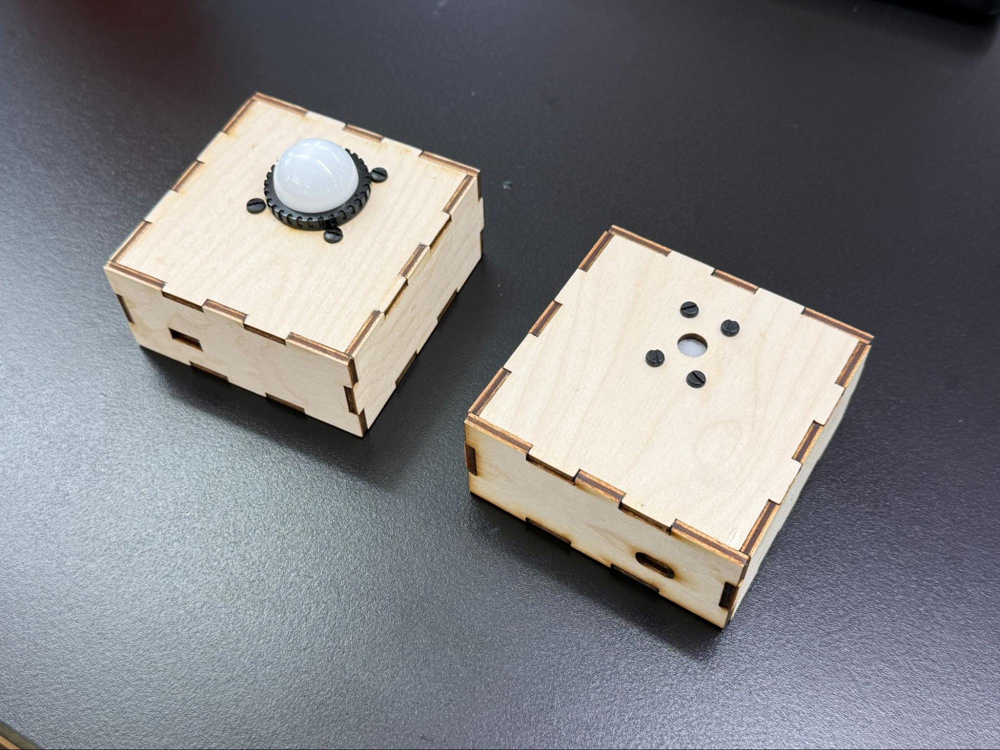

*Figure 1. Two housings for the AS7341 spectral sensor and its supporting electrical components.* 

# The Enclosure
## Materials

The material used for the enclosure should be opaque or have little as light transmission as possible. In the models shown in Figure 1, laser-cut 3-layer plywood was used. This way you have the most control over the light that is delivered to the sensor. If the construction of your housing has seams that let light in, consider sealing them with tape or caulking. 

## Cable Access

If the enclosure has a cable cutout, for either power or data cables for the microcontroller, consider the placement to limit the amount of light leak that may affect the readings you take. It is possible to get panel-mounted cable plugs for both power and data, and if you need a cable mount, these are a good idea. However, the easiest solution is to avoid this if possible, and put a battery in the case. As long as you can open the case to access the battery, you can operate your device. 

## Light Access

When cutting the light access and mounting holes for the sensor, consider what light filter you will be using. Mount the filter directly above the sensor, include a diffuser, and limit any opening around the sensor in order to limit extraneous light. 

# The Electronic Components

## Sensor 
Mount the sensor breakout board directly to the enclosure if possible. This ensures that the position of the sensor is always at a fixed position in the opening, even if other components are not fixed within the enclosure.

Minimize the space between the opening and the sensor. The more recessed the sensor sits within the enclosure, the more shadows cast from the opening can affect the readings. This becomes less of an issue if the opening has a larger diameter to accommodate a filter (see [receiving light](#receiving-light) section for more info). 

If the breakout board has connectors on it, some space between the sensor and the opening is inevitable. That's okay, there are other ways to diffuse the light. But get the sensor as close as possible to the opening to minimize shadow. 

Many breakout boards include a power LED or other status LEDs. These can interfere with the readings, so it’s a good idea to block them or remove them. 

## Microcontroller

This housing uses an Arduino Nano 33 IoT paired with a [Sparkfun Qwiic Shield](https://www.sparkfun.com/sparkfun-qwiic-shield-for-arduino-nano.html?gad_source=1&gad_campaignid=21251727806&gbraid=0AAAAADsj4EROth5VIAJDwOQUFCoWh_7rh&gclid=CjwKCAiAvaLLBhBFEiwAYCNTf3dJPLuWM5Uxj6w1B33B50hbKpQcnWbGNFj-HEiDKaqE8UxCK7zX-BoCg-QQAvD_BwE). The [Adafruit AS7341 board](https://www.adafruit.com/product/4698) also comes with Qwiic connections so using the shield is an easy way to connect the two.

In Figure 2 below, the microcontroller is not fixed to the enclosure. For a robust device housing, though, you should mount all the components to the housing.  
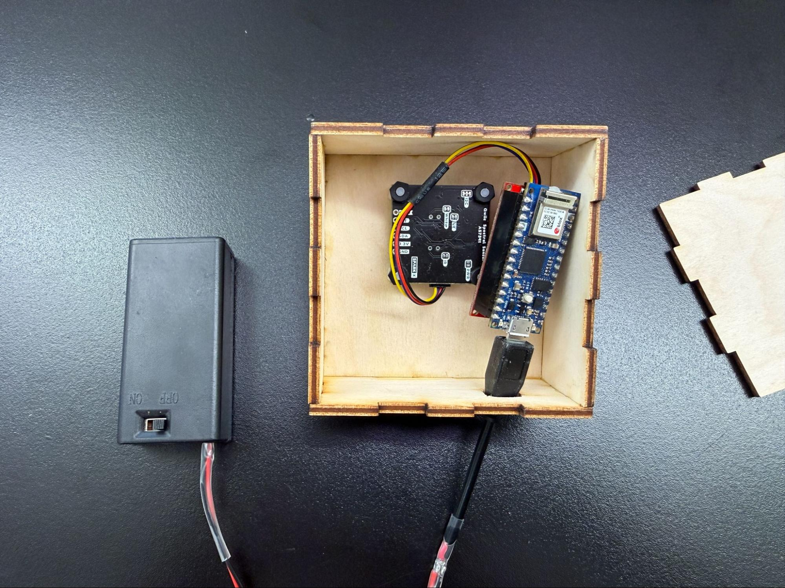  
*Figure 2. Inside of the housing, showing the microcontroller and power components unmounted.* 

## Power Source
Consider how the sensor microcontroller will be powered. This might be dictated by how the sensor will communicate to the data output display, but the simpler you can make this connection, the better for construction. 

* Will it be wireless or a wired connection?  
* Will you be powering from a power outlet or a portable power source?  
* An option is to supply power with a 9V battery through the USB port. There are various  battery cases that have built in on-off switches. [Here’s an example from Digikey](https://www.digikey.com/en/products/detail/med/BH9V1S/16627188). Figure 3 shows the case in action. 
  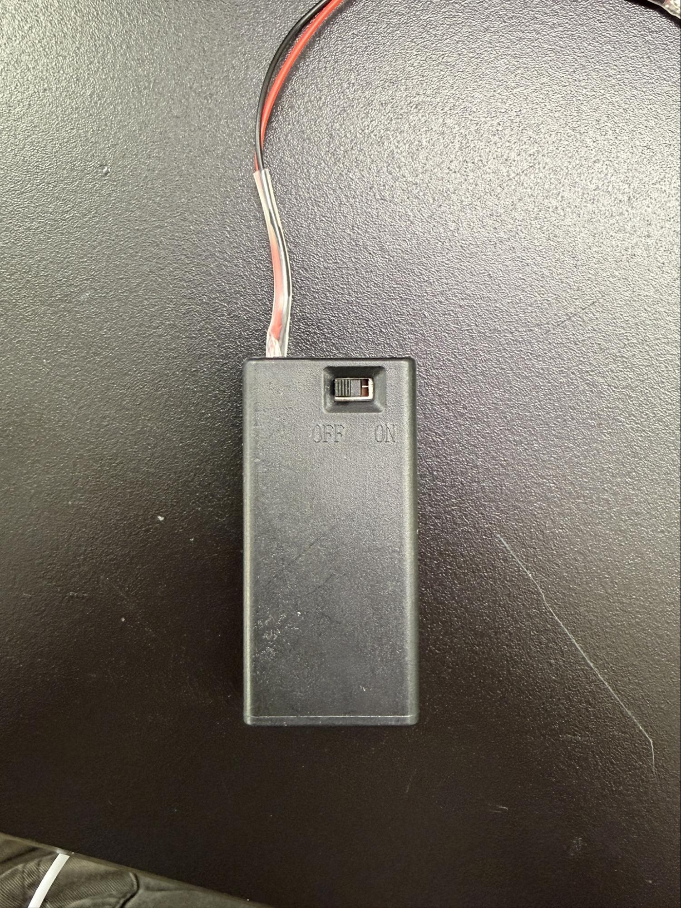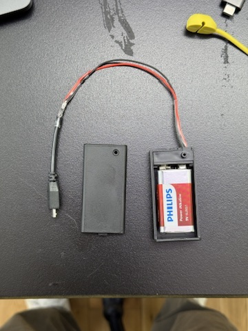  
  *Figure 3. 9V battery case with switch, open and closed views.* 

Many sensors in this area communicate via I2C. Various electronics vendors sell adaptor cables and plugs to make this easier.Sparkfun uses a connector called [Qwiic](https://www.sparkfun.com/qwiic) which connects the I2C and power connectors all in one cable, eliminating the need for soldering. Adafruit have a similar brand called [Stemma](https://learn.adafruit.com/introducing-adafruit-stemma-qt?view=all), Seedstudio uses [Grove](https://www.seeedstudio.com/category/Grove-c-1003.html), and DFRobot uses [Gravity](https://www.dfrobot.com/gravity.html). They all support I2C, and they all have custom solderless connectors. They are not all compatible with each other, however, Qwiic, Stemma, and Arduino’s Modulino connectors work well together. For mor on this, [this tutorial](https://itp.nyu.edu/physcomp/lessons/intro-to-sparkfun-qwiic-i2c-shield-for-arduino-nano/) introducing the Nano Qwiic shield.

If using a Qwiic shield on the nano, think about how the Vin and GND pins will be affected. In the example shown in Figure 4, all pins are covered by the shield, so power would need to be supplied through the USB port, or soldered to the shield’s Vin and GND pins.  

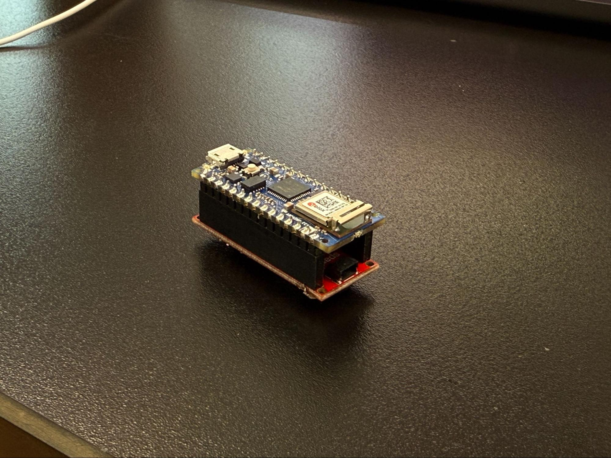 
*Figure 4. Arduino Nano 33 IoT mounted to a Qwiic shield.* 

# Receiving Light

## Centering the Sensor

Centering the sensor will ensure an even distribution of the incoming light. You should minimize any shadows from the opening. Take note of where the sensor is placed on the breakout board. Make sure the housing opening is big enough to allow room for this. 

On most breakout boards. the sensor is usually centered on the board,  but make sure you’ve centered it in your housing opening before finalizing the enclosure design. Figure 5 shows three different breakout boards, with the sensor in slightly different positions on each one.   
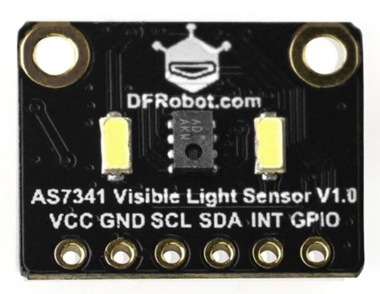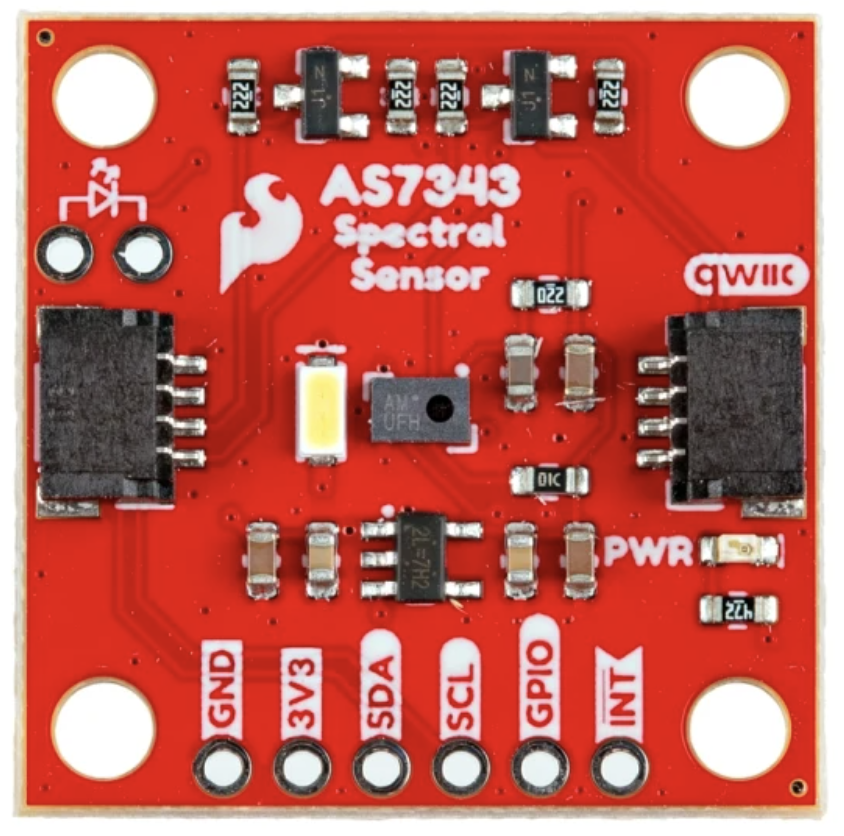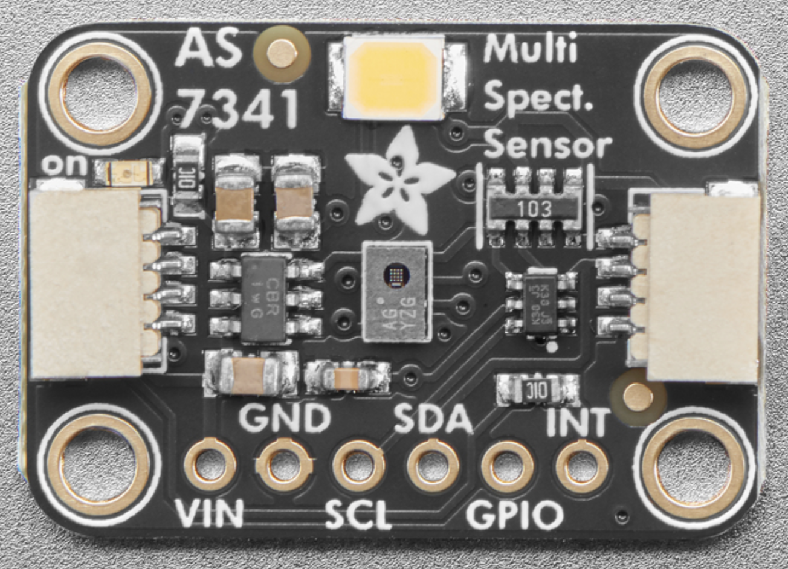  
*Figure 5. These three breakout boards are all for the same sensor, the AMS AS7341 sensor. The position of the sensor relative to the mounting holes is different, however, so each would need a different mounting design.*

## Light pollution

To ensure a cleaner reading from the sensor, try to limit the amount of light leak exposed to the sensor. Most breakout boards have an onboard power LED indicator (Sparkfun board has a red LED, Adafruit board has a green LED). Consider covering that so it does not affect the sensor readings. 

Most boards also have a white LED that you can turn on and off. This is used for when you’re using the spectral sensor to sense the color of a given object. When you’re using the sensor to make a light spectrometer, turn this off. 

## Filtering light

The light sensor already has a pinhole design to ensure a wider range of light exposure, but it is still a good idea to add some light diffusion. Here are three options:

* **Printer paper** is an economical and simple material option. This diffuses light, but the paper pulp can filter light unevenly, so it is not recommended for accuracy’s sake.  
* Sekonic meters have **domed diffusers**, which you are able to purchase as [replacement parts](https://www.bhphotovideo.com/c/product/119341-REG/Sekonic_401_821.html), and they are affordable for a DIY meter. Figure 6 shows these diffusers.   
* In the datasheet for the AS7341, AMS recommends **[Kimoto 100 PBU Kimoto OptSaver L-57 diffuser](https://www.kimoto.ch/products/product-detail/detail/l-57.html)**. You can order samples in standard printer sheet sizes from Kimoto. Figure 1 shows two meters, one with a Sekonic dome, and one with a Kimoto flat filter. 

  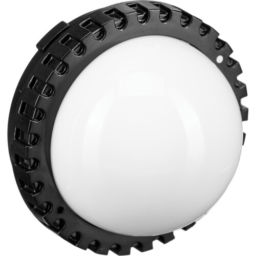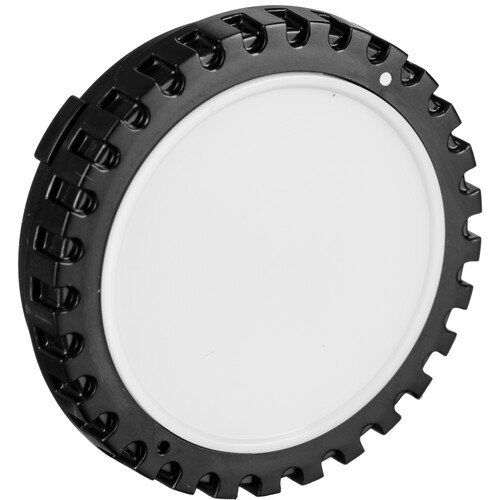

*Figure 6. Sekonic dome diffusers.*

Diffusers can be flat or spherical. There isn’t a right or wrong filter for a light meter, as it depends on what you are trying to measure. If you want to focus on direct light or light measurements on a flat surface, a flat diffuser can work well. If you want readings from omnidirectional lighting, however, or read how light would fall on a 3D object (like a person’s eyeball), then a domed filter would produce readings from broader light exposure. A dome provides correction for light which hits the sensor at an oblique angle. This is known as “cosine correction”. Figure 7 shows how it works. 

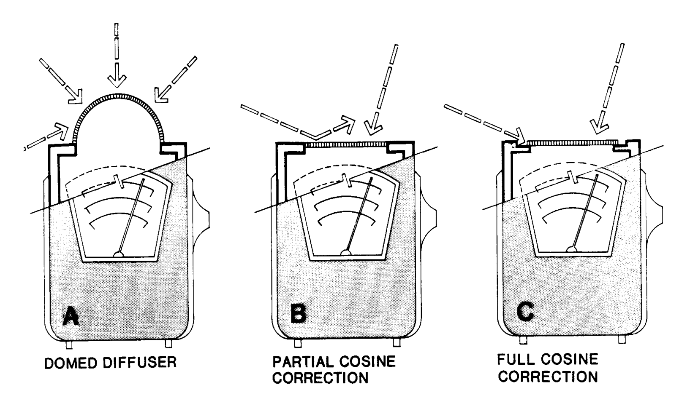*Figure 7. Cosine correction effects of a domed diffuser. Figure source: Schiller, Mark.* [Interior Illuminance, Daylight Controls and Occupant Response](https://www.researchgate.net/publication/228688521_Interior_Illuminance_Daylight_Controls_and_Occupant_Response). *ResearchGate, January 1997.*

With those considerations in place, you should have a DIY sensor box that will give you reasonably good readings. It's always a good idea to calibrate your device against a known, calibrated spectrometer, however. 